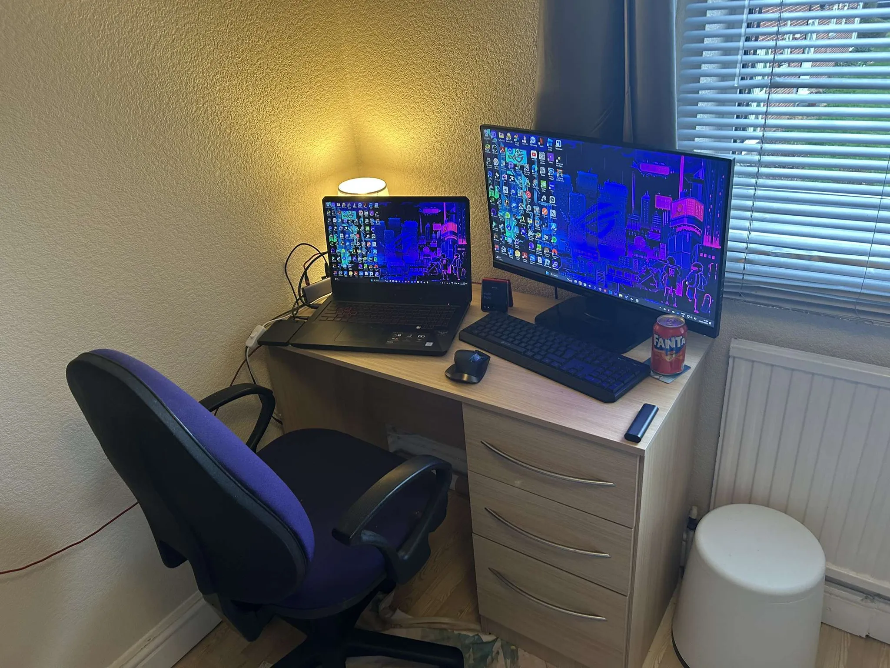

## Who are you and what do you do?

My name is Asa. I am a Business Computing student at the University of Northampton. I grew up in Oxford and was in the first cohort to study a T-Level in Digital Production, Design and Development. This was a great course and, as well as learning programming and business skills, I , also, had the opportunity to work for Oxfordshire County Council as a customer support engineer. I work at Vue cinemas when I’m not studying.

## What first got you into tech?

I have always been interested in Tech. Both of my parents work in IT, so I was introduced to it at a young age. My first experience of coding was on a micro:bit, making a game on the 25 pixel screen. After that I built and coded with Lego MindStorms, and later took part in the First Lego League with a group of friends at school. I also got my first raspberry pi and learnt about Linux and servers. I put this to good use during covid by running a minecraft server for my friends, and creating some mods for them.

While at school, I created my own website and added various mini games for friends to play, as school blocked sites with games on. I continued to develop for this throughout college adding small projects. I, also, created a website for the local Girlguiding District.

## What does your typical working day look like?

Being a student, I have different lectures, online lessons and labs each day. Luckily none start very early. I usually get up around 12 and eat and chill out playing a game. Then if my lecture or lab is on campus, I take a short walk across town to it. I usually pick up a meal deal on way past the supermarket.

Each term we cover 3 modules. This term there’s a UI/UX module, setting up and administrating a Windows server and a group project. The group project is to create an application and the business fundamentals around it, such as WebMaster, project manager, marketing etc.

I usually finish with classes around 6pm and walk home. I usually eat dinner and watch a film with my flat mates and then code, or play a game, until late into the night.

## What’s your setup? Software and hardware. Pictures welcomed!

Hardware:

- ACER KA272 Widescreen LCD Monitor
- ASUS TUF FX705
- Logitech MX master
- SONY WF-C700N

Software:

- Intellij IDEA Ultimate as the IDE
- ARC for browsing
- Notion for notes & productivity

## What’s the last piece of work you feel proud of?

I customised my Fitbit clock face using the Fitbit API, adding the information I was interested in as well as images to create a right aesthetic.

I am proud of the Girlguiding Kidlington website. They had a very old html site that needed lots of manual updating, so I moved them to use a CMS, which they could update themselves. The new look site follows their branding guidelines and is a great marketing tool.

## What’s one thing about your profession you wish more people knew?

You don’t have solve problems on your own, there’s lots of communities both online and in person to help. Like the NN1 Dev Club, where I’ve learnt about other people’s experience and technologies, giving me a wider understanding of the tech world.

## Share with others something worth checking out. Not necessarily tech related. Shameless plugs welcomed.

https://pigsare.pink/

This is my portfolio, which I made from scratch. It uses html, css and javascript.

https://asamasterson.com/

This is my website, which I started in secondary school and have continued adding to ever since. My latest projects can be found on https://github.com/asa-masterson
