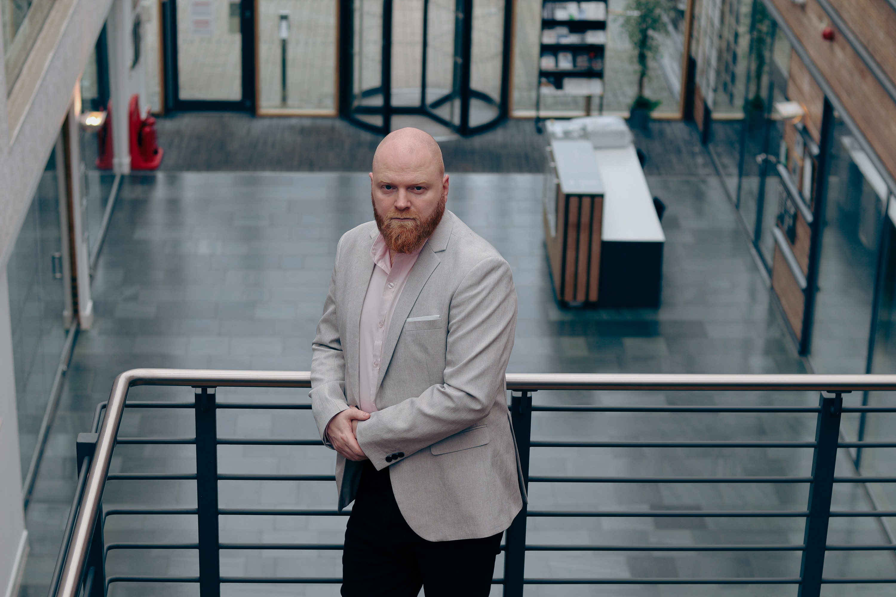
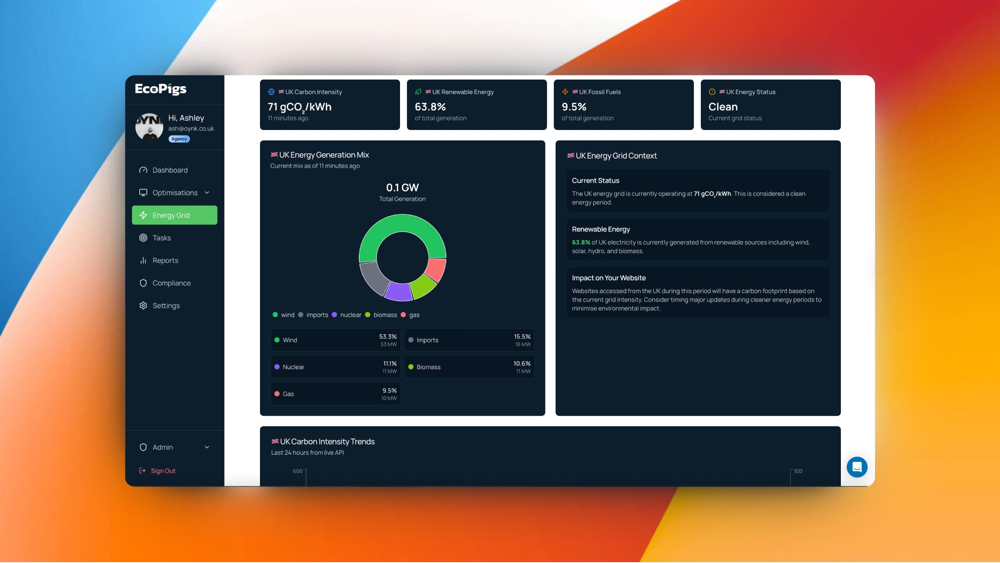

## Who are you and what do you do?

I’m Ashley John, founder of OYNK, an award-winning digital agency based in Northamptonshire. We build high-performance, low-carbon websites, and we also do branding, brand strategy, and sustainable workshops.

I’m also the creator of EcoPigs, a platform that measures and helps businesses reduce the carbon emissions of websites. This is my best ever work.

## What first got you into tech?

I was originally exposed to the tech world when I worked as a product development manager for a SaaS business in around 2011. I was not a very good coder, often needing to use google to figure things out before this role, but I was always able to sort of read the code and find where issues were that others couldn’t find. It was a puzzle in another language and it excites me still to this day that typing some words on a screen makes things happen.

## What does your typical working day look like?

I have a strong routine that I stick to each day. After dropping the kids off at school/nursery, I am lucky enough to be in a position where I can afford to spend an hour with my wife at Starbucks. It helps me no end, being able to relax before work. But as soon as I am in the office, I like to get into client requests early and then once I have finished with client tasks for the day, I will work on my EcoPigs tool.

## What’s your setup? Software and hardware. Pictures welcomed!

I don’t have much of a glamorous set-up. It's simply a MacBook Pro M2 that I connect to an external monitor. When I am not using it as a standalone tablet, I use my iPad Pro M4 as a smaller additional screen. It's not inspiring at all, I am afraid.

I do game on a gaming laptop with an RTX 4070 in it, but that's as far as my setup goes.

## What’s the last piece of work you feel proud of?

EcoPigs. I will keep talking about it but it’s something I am happy to share with the world. I started building green websites a while back, the performance aspect of building them was why I focused on this sort of site initially. When I was building them I was never aware of the green aspect though. It was only later on when I heard about low carbon websites and there were ways to track them that I got into it for those reasons. However, I never wanted to scrutinise my own work based on other peoples findings so I built my own mini version which was a monument of a .mjs file. 1000s of lines. It did what I needed to do but it wasn't as efficient as I wanted it to be. However, you could go on the website, enter your email and URL and in your inbox you would receive a report.

But this wasn’t right for me either - I needed it to be more. Now its a full SaaS dashboard that is connected to 27 countries national grids, and will track your website emissions live. It can tell you what images to optimise and even at the press of a button, optimise them for you. It also has scope 3 compliance reports built in too.

## What’s one thing about your profession you wish more people knew?

I wish more people knew that a green website is actually more than just some sort of box ticking exercise. It goes further than that and when you get a website built for you to be green, you will almost certainly be offering your visitors a better, faster, experience than they were previously, google prefers low carbon sites so it will rank them higher generally and even if you don’t really care about doing good for the planet, a low carbon site built properly, should help you convert more visitors.

The other thing is don’t try to strive for maximum scores. To get a website to be as low as possible means to sacrifice a lot of creativity. Instead of focusing on grades - like A to F, we aim to build a site that is under half a gram of CO2 per page load.

When most green companies tell you what they have built, they will only tell you a single pages score. This means they could strip the homepage to the bare minimum and then have the rest of their site perform poorly and be full of bloat.

Thats why I built EcoPigs because it shows you every single pages size, emissions and score.

## Share with others something worth checking out. Not necessarily tech related. Shameless plugs welcomed.

Obviously, I would say EcoPigs, but if it isn't that, then I would say go and watch Epic Spaceman on Youtube if you haven’t already. Its just a guy who explains the universe in such wonderful ways, using cereal to show scale, and he’s built it all himself in blender. It's just phenomenal work and a pleasure to watch.

