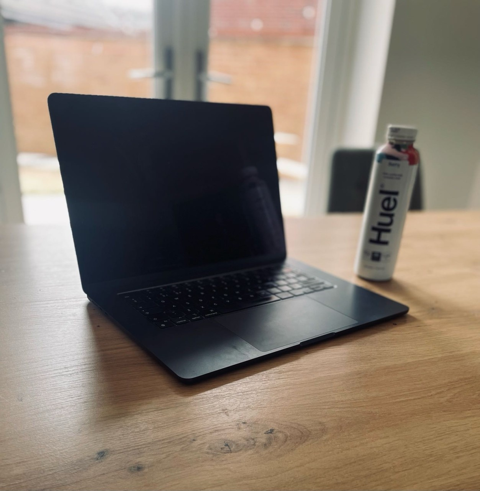

## Who are you and what do you do?

I’m the director of two companies: NRCM Web Design, my main web solutions agency, and SQ1 Digital, a software company I co-own.

I work with our teams to create customer acquisition systems, onboarding flows, personalisation engines and the digital machinery behind the websites people see. Basically, all the clever bits that hopefully turn visitors into customers.

I’m also very proud to be from Northampton. Although we help businesses all over the world, supporting local businesses and enterprises will always be important to us. We also invest a lot into youth sports across the county, helping young people access opportunities through their local clubs and teams.

We were recently delighted to win the Best B2B Business Award at the Northants Life Awards, which made that connection to the local community feel even more special. It also gave us a very good excuse to celebrate.

## What first got you into tech?

It started more than 20 years ago, when my closest friend at school was studying GCSE IT and showed me how to write basic HTML. I was mesmerised.

I didn’t own a computer at the time, so I would write the HTML down on paper. When I went to his house, we’d use my notes to build websites in Notepad. My journey into technology was, ironically, almost entirely analogue.

## What does your typical working day look like?

The day usually starts with internal stand-ups and catch-ups with our clients’ teams. From there, it becomes a mixture of managing my own workload, supporting the team, planning, coding, calls and discussions throughout the day, although not always in that order.

“Typical” might be stretching the definition slightly. There’s always something new to solve and usually another Slack notification arriving while we solve it.

## What's your setup? Software and hardware. Pictures welcomed!

I intentionally don’t have a fixed workspace. My entire setup is a MacBook, and I like working from a different space each day.

Software-wise, I spend most of my time in Slack and GitHub. I’ve also been using Devin a lot recently, alongside Claude and Codex.

My office is wherever the MacBook opens, the coffee is decent and the Wi-Fi works.

## What's the last piece of work you feel proud of?

Our team recently created a bespoke WordPress theme and plugin for one of our clients. It allows their web team to build pages using components from the company’s shared internal component library.

Once a page is ready, they can push it safely to the live environment and continue making changes in the test environment, without ever having to edit the live site directly.

It gives their team much more independence while protecting production from those dreaded “who changed the live site?” moments.

## What's one thing about your profession you wish more people knew?

A website on its own isn’t enough.

You need to understand your audience and build the wider experience around them, including how you introduce them to your product or service and guide them towards becoming a customer.

Doing that well takes a huge amount of research, learning, iteration and user testing. It’s rarely a case of simply launching a website and calling it finished, despite how tempting that sounds.

When the whole system starts working, though, it’s extremely rewarding.

## Share with others something worth checking out. Not necessarily tech related. Shameless plugs welcomed.

You’ve given me permission for a shameless plug, so here it is.

If you’re a WordPress user, check out our plugin, [WP Extended](https://wpextended.io/). We originally created it to solve an internal need.

It consolidates the functionality of multiple plugins into one modular plugin, so you can enable the features you need without filling your WordPress installation with separate tools. Fewer plugins, less clutter and fewer things demanding an update at the worst possible moment.
