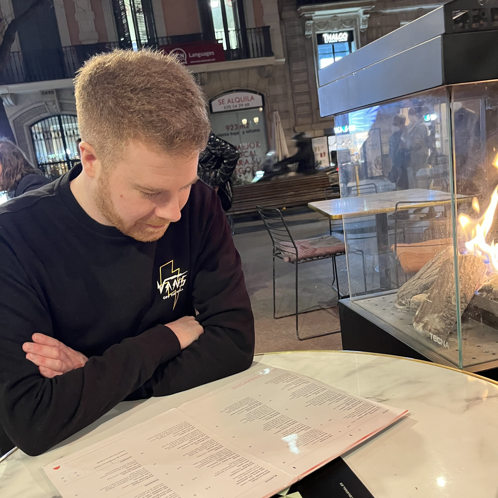

## Who are you and what do you do?

Hello! I'm Dan. If you asked my friends what I love, they'd probably say basketball, music, and puzzles. I also quite like a glass of wine.

From 9–5, I work as a Tech Lead at Mindera, where I lead a team working primarily with React and TypeScript, all running on AWS.

## What first got you into tech?

My dad. I remember when he brought home our first family PC; a Windows 95 machine with a massive 3GB hard drive. When I wasn’t playing slightly questionable Pokémon ROMs, I was exploring HTML in Microsoft FrontPage (back before CSS was invented).

He’d also bring home old hard drives for me to dismantle with a screwdriver, it was like digital archaeology.

In my late teens MySpace appeared and let you modify your profile with css and minimal JavaScript. That was when I realised I want to do software as a career.

Growing up during the early internet boom, it was hard not to fall in love with tech.

## What does your typical working day look like?

I start the day with coffee and feeding my two cats, Belle & Sebastian. I’m usually in the office just before 9am, where I catch up with the team over more coffee.

Our day begins with a stand-up where I help resolve technical blockers and make sure everyone has what they need. The rest of my time is spent aligning on upcoming work, reviewing code, and unblocking devs and QAs.

It’s not always glamorous, and it can feel a bit thankless at times, but it's deeply rewarding helping others grow and succeed.

## What’s your setup? Software and hardware. Pictures welcomed!

My work machine is a 14" M4 MacBook Pro. At home, I use a PC I built during lockdown. Switching between them can be a pain, but I’ve finally stopped hitting cmd when using Windows.

For the full list, you can check out my [uses page](https://www.danjordan.dev/uses).

## What’s the last piece of work you feel proud of?

As a Tech Lead it can be a struggle to slow down and realise when you've done good work. When something is released I will already be thinking about the next piece of work and in reality the team did all of the hard work, not me.

We did recently release made to measure shutters onto dunelm.com though. That project was very complex, but we managed to give the business and our customers everything they need. We've since been able to add some more features/capabilities to it all too, so I'm very proud of the teams work on that.

As a silly answer, I was recently asked the question...

> If you were given 1000 cherries how many would you eat if you got £100,000 for each one. The caveat is that one of them is poisnonous.

We had a good laugh discussing that with everyone so I made a small app for people to play with and see how brave they are. The money and poison are entirely fictional, feel free to click away... https://cherrygame.netlify.app/

## What’s one thing about your profession you wish more people knew?

CORs! Go read this https://jakearchibald.com/2021/cors/

I think this question means people outside the profession though 😂

In that case I wish more people knew you don't need to be super smart to be able to code. You don't need to have a job as a programmer to code. Anyone can code and anyone can enjoy it. No matter how big or small the project you are coding you're still going to get something out of it. Just don't make anything evil.

## Share with others something worth checking out. Not necessarily tech related. Shameless plugs welcomed.

- [Atlas Obscura](https://www.atlasobscura.com/) - If you are going on holiday and Trip Advisor looks a bit boring, check out Atlas Obscura. It's full of weird and wacky places to visit.
- [Cracking The Cryptic](https://www.youtube.com/@CrackingTheCryptic) - If you thought Sudoku was just a 9x9 grid of numbers, you are very wrong. These guys started solving variant sudokus on YouTube during lockdown and it's been a favourite of mine since.
