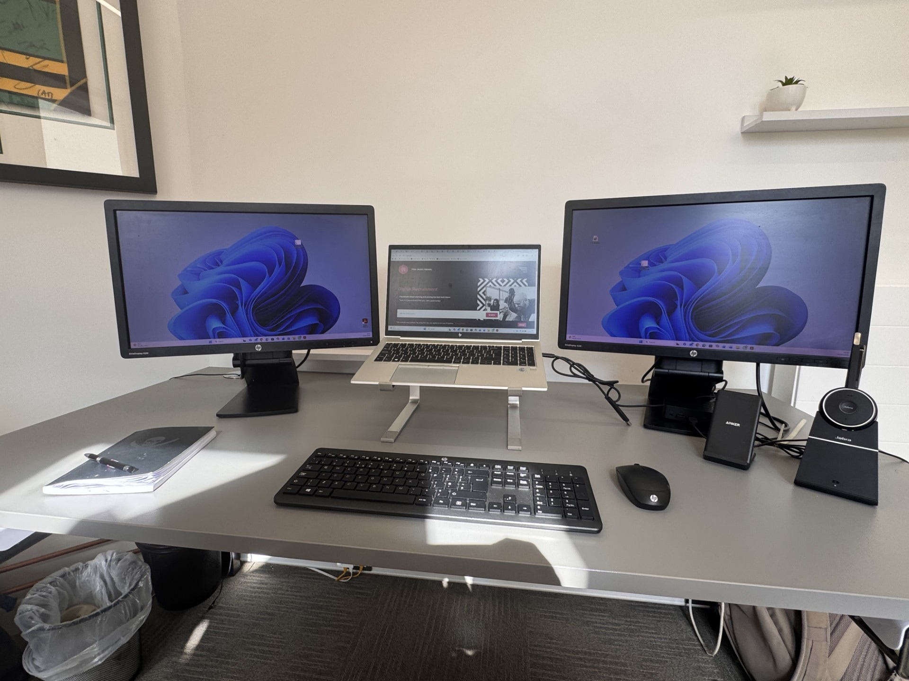

## Who are you and what do you do?

I'm Darren Sharp – founder of S-SA Digital Recruitment, a specialist IT talent consultancy, co-founder of NN1 Dev Club, husband, dad of two, and (according to some people) the bloke usually handing out the pizza and drinks at NN1 events. 🍕🍻

## What first got you into tech?

Completely by accident... through my job!

I was hired to recruit into the then rapidly growing web market, and I've never looked back. I've recruited in tech ever since, and that sparked my passion for Tech

One of my first major clients was a little startup called [Lastminute.com](https://www.lastminute.com/). I worked with the founders and helped build their initial development teams. (Please don't use that fact to work out my age! 😂)

## What does your typical working day look like?

Controlled chaos... fuelled by coffee! (As Pawel will confirm everything for me is last minute as im always juggling 101 different plates)
Most days start around 8am, working through emails and planning my call list for the day. (Although, if I'm honest, I'm probably answering emails long before and long after those hours too!)

From 9am onwards it's usually a mix of candidate calls, interviewing, shortlisting, client meetings, business development, solving recruitment puzzles, negotiating offers, and occasionally acting as part recruiter, part careers adviser and part therapist. (That's where the psychology comes into play – see my recommendation in "Something worth checking out!")

Somewhere in between there's about 10 cups of coffee, plenty of Teams calls, and the inevitable "quick five-minute chat" that somehow lasts an hour.

No two days are ever the same... and that's exactly how I like it.

## What's your setup? Software and hardware. Pictures welcomed!

Compared to most of the developers at NN1... it's pretty boring!

I'm currently using an HP EliteBook with a dual HP monitor setup. It does everything I need for running the business.

I'd secretly love to switch to a Mac one day, but after spending decades on Windows, I think my brain might refuse to cooperate.

## What's the last piece of work you feel proud of?

We recently delivered our first Graduate Apprenticeship programme for JTI in London and managed the entire recruitment process.

It's genuinely one of those opportunities that can change someone's life—earning a salary, gaining real commercial experience, and having your university degree fully funded at the same time. Helping someone start their career like that is incredibly rewarding.

## What's one thing about your profession you wish more people knew?

That it really isn't as easy as people think!

Recruitment isn't just matching CVs to job descriptions. It's about people, relationships, expectations and emotions. You're often helping someone make one of the biggest decisions of their career while also helping a business make a significant investment in the right person.

Sometimes you're delivering brilliant news, sometimes you're having difficult conversations, and sometimes you're managing expectations on both sides at the same time.

When it all comes together and you help someone land their dream job (or help a client find the perfect hire), it's one of the most rewarding jobs in the world.

## Share with others something worth checking out. Not necessarily tech related. Shameless plugs welcomed.

Rather than recommending a piece of tech, I'll recommend a book.

Some of you know I'm a keen martial artist, and I'm fascinated by the philosophy behind martial arts just as much as the training itself.

I'd recommend Tao of Jeet Kune Do by Bruce Lee. It's not really about fighting—it's about simplicity, adaptability, continuous learning and removing what's unnecessary. Those ideas apply surprisingly well to business, life... and even software development.

(Although I wouldn't recommend trying the one-inch punch in your next stand-up meeting. 😄)
