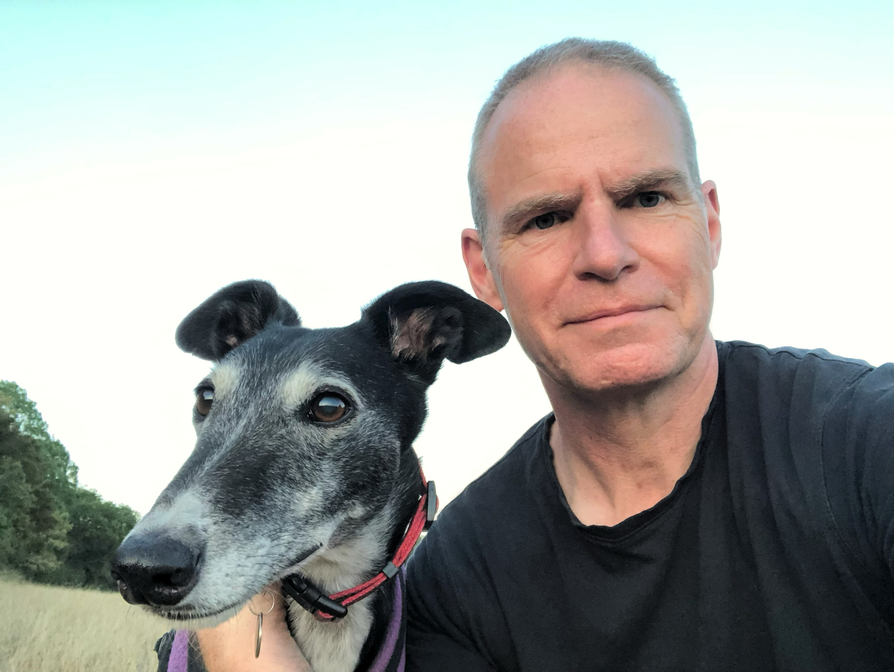
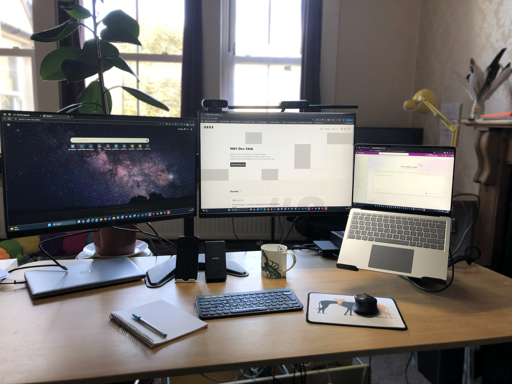

## Who are you and what do you do?

I’m Douglas, founder of [Carduan Ltd](https://www.carduan.com/), a consulting firm that helps companies to optimise and automate their processes. I’m a husband, dad to three youngsters and devoted companion to two greyhounds.

I set up Carduan Ltd to help engineering and manufacturing companies boost productivity. Many companies rely on Excel spreadsheets and the tacit knowledge of key staff to keep operations running. This creates risk and inefficiency. I use low-code tools to help teams automate and standardise these processes—bringing reliability, repeatability, and control.

## What first got you into tech?

My first tech was playing a lunar lander game on my Dad’s Hewlett Packard programmable calculator. The BBC micro and Commodore 64 computers at school didn’t capture my interest – the programming projects seemed too detached from real-world problems.

It was the kinematics function (how things move in space) in the Computer Aided Design system at University that captured my imagination. My final year project was building an articulated human avatar for use in ergonomics in virtual environments. I loved creating a digital product with clear applicability in the physical world.

I continued post-grad at University and my PhD thesis was on how to bring design tools directly to the CAD workspace, for example materials choice or standard parts selection. The programming was done in Fortran, with a few REXX utilities.

Most of my career has been in consulting on how to use technology and data to enable efficient and productive processes. The principles are the same whether dealing with manufacturing companies, healthcare, finance or transport. Companies run on processes enabled by data. How well the company performs is tightly bound to how well controlled are the processes and the quality of the data.

## What does your typical working day look like?

I start the day around 7:00 with a dog walk; a good time to catch some daylight and do some thinking.
By 9:00 I’m at my home office desk. I plan time according to a task hierarchy:

- Compliance and admin: keeping square with HMRC
- Customer project work: always the top priority
- Business development
- Learning and research

We aim to have a family meal around 18:30. Evenings are a time for karate training, dog walking or fixing stuff around the house. I sometimes get two or three hours where I’m able to be very productive doing routine tasks. The desire to finish something that day can be a powerful motivator.

## What’s your setup? Software and hardware. Pictures welcomed!

### Hardware

- Microsoft Surface Laptop 7 with Surface docking station 2
- Dell U2415 (main), Dell U2414H (secondary) monitor
- Logitech K380 keyboard and M330 mouse
- Steelcase leap v1 chair
- Sit / stand desk (truthfully, mostly sit desk)
- Paper notepad and pen to offload ideas

### Software:

- Azure DevOps to define and manage everything
- Outlook calendar to schedule the week
- Clockify to track and record time
- Microsoft power platform for low code development
- Github Copilot for PowerFX code analysis and creation
- ShareX for screen capture
- XRMToolbox and Level Up for Dynamics 365 for Microsoft Dataverse utilities

## What’s the last piece of work you feel proud of?

As CTO of a health tech company, I led development of a patient engagement platform that helped chemotherapy patients stay out of hospital and feel better informed, reducing anxiety at a stressful time. The work was recognised with a Patient Safety Award for the NHS Trust.

More recently, I’m proud of every day that I show up at my desk ready to do work, particularly those days where I don’t know how to solve the issue of the day, where uncertainty is high and a path to progress far from clear. As a solo entrepreneur, one thing is certain: if I don’t keep up the momentum, no-one else is going to do it for me!

## What’s one thing about your profession you wish more people knew?

Tech projects succeed when people are included in the change. Change management is often undervalued, but it’s essential to avoid leaving anyone behind.

## Share with others something worth checking out. Not necessarily tech related. Shameless plugs welcomed.

- Networking: [Business Buzz](https://www.business-buzz.org/) – business meet-ups in Northampton and other towns
- Change Management: [Prosci](https://www.prosci.com/) – a good framework and blog
- Greyhound adoption: [Brambleberry Greyhounds](https://www.facebook.com/groups/BrambleberryGreyhoundsGT), [Galgos del Sol](https://galgosdelsol.org/). Elegant and lazy hounds looking for homes
