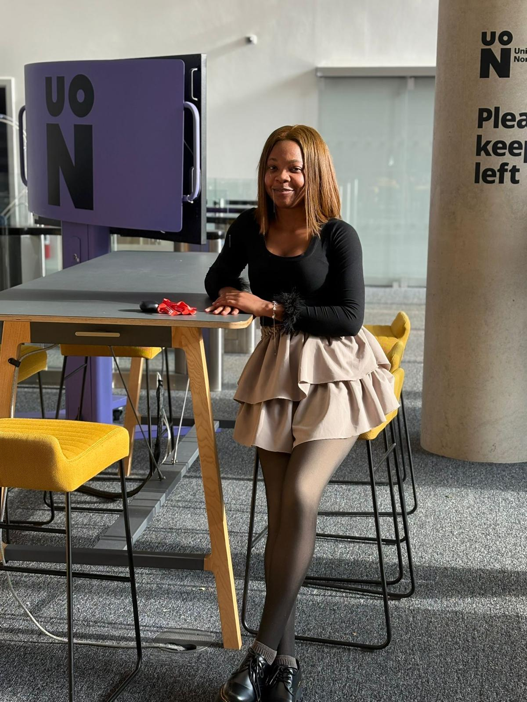
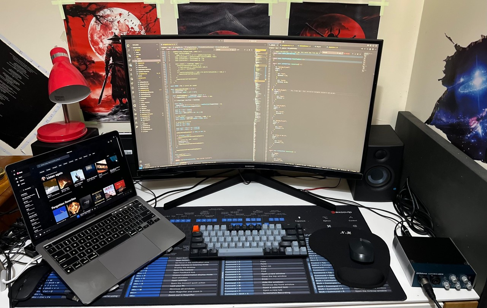

## Who are you and what do you do?

I’m Emmanuella Okorie 👋

- I love trying out new things and I’m not scared of a challenge.
- Table tennis is part of my weekly routine.
- Music? Can’t go a single day without it.
- I enjoy conversations that spark fresh ideas, and if they’re fun too, even better.

I'm a software engineer who’s spent the last three years in the data visualization space, building complex frontends and finding creative ways to make data feel simple and user-friendly. Right now, I’m wrapping up my Master’s in Software Engineering. For my dissertation, I’ve been working on an indoor navigation system, which has been both challenging and super exciting. On the side, I like to write about technical concepts I find interesting. it’s my way of sharing what I’ve learned and keeping ideas flowing.

## What first got you into tech?

At 17, in my third year of university, we were introduced to C++, and I immediately took a strong interest in it. It was the most challenging thing I’d come across that wasn’t entirely math, and that made it new and exciting for me.

I didn’t even have a laptop then, so I wrote code on my phone using SoloLearn. I wanted to do something with this new power, so I started learning about microcontrollers and how to control them with C++ using Arduino. I built a bunch of cool stuff, including an automatic trash can using a portable bin my dad had brought home as a souvenir.

That was the point I knew I wanted to make a career in programming, even though I was studying Electrical Engineering. The decision got even stronger when I discovered on LinkedIn how much software engineers could earn. The idea that I could do something I loved and make a good living out of it? My teenage self was completely sold.

## What does your typical working day look like?

I’ve been working remotely with a great team for the past three years, and I honestly enjoy every moment of it.
Since we’re a relatively small team, the work is always engaging and very hands-on. Most of my time goes into building the frontend architecture of one of our core products , The Dataxplorer app. It is a highly interactive environment that lets users create their own data visualizations and tell stories with them. I also chip in with middleware and backend work when needed.

Because I usually sleep past midnight, I don’t wake up before 8 a.m., which still gives me enough time to get ready for our daily standup.
Outside of work, I carve out time to write new articles and push forward with my dissertation. In the evenings, I often go play table tennis, it’s my way of staying active, and trust me, it can get pretty intense.

Now that my lectures are over, my days feel a lot freer, so I try to maximize and enjoy them as much as I can. And one last thing, I can hardly function without a nap, so I always make space for an hour of rest in my day.

## What’s your setup? Software and hardware. Pictures welcomed!

My computer is a 13” M2 Macbook pro. I also use a 32” Samsung monitor.

## What’s the last piece of work you feel proud of?

Honestly, I’d say [Dataxplorer.org](https://dataxplorer.org). It’s the product I’ve spent most of my time on over the last couple of years as one of its core developers. Working on it has taught me so much - everything from handling complex frontend states to writing scalable tests and covering tricky edge cases.

I’m really proud of how far it’s come, even though it’s still early days. New releases are rolling out frequently, and it’s exciting to see it grow. You should definitely check it out!

## What’s one thing about your profession you wish more people knew?

One thing I wish more people knew is how much being a programmer shapes you personally, beyond just shipping products. There’s something profound about solving a problem that at first feels impossible. And we get to do that every single day!

Over the years, this has taught me to stop doubting myself and to trust my ability to figure things out, no matter how tough they seem. That, to me, is the real gift of being a programmer.

## Share with others something worth checking out. Not necessarily tech related. Shameless plugs welcomed.

Definitely MCP (Model Context Protocol). I spend a lot of my free time following how MCP is growing and being adopted, and I’m convinced it’s going to completely change the way we build and interact with software.

I’m actually giving a talk on MCP and its possibilities very soon, so stay tuned!
