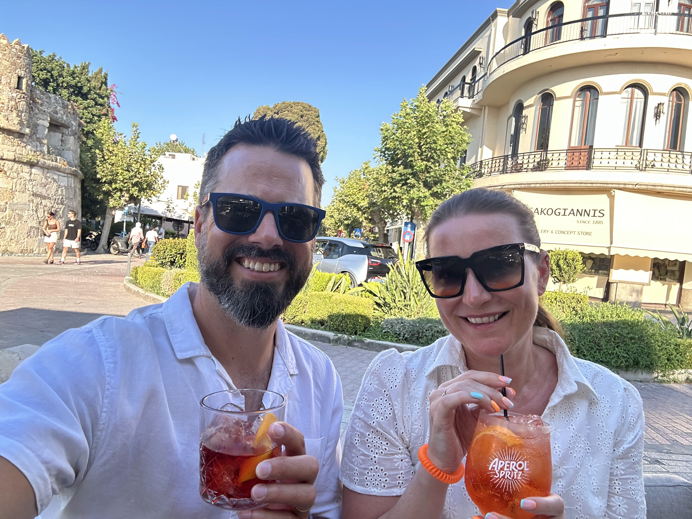
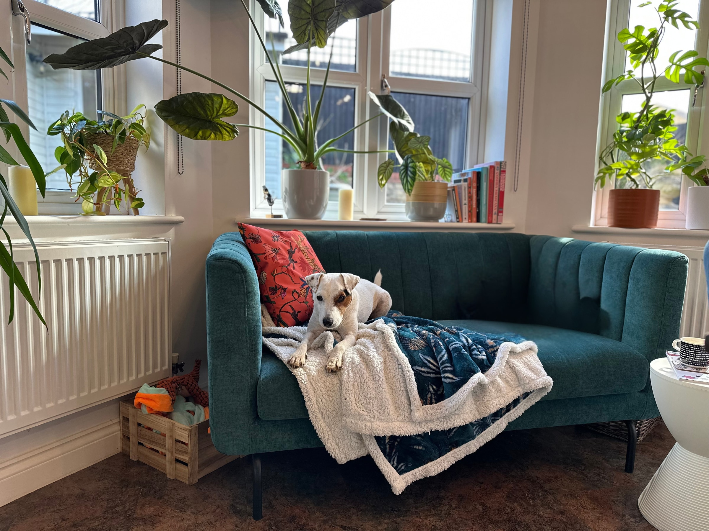

## Who are you and what do you do?

My name is Eric Bye, a Canadian who's been living in the UK for almost 7 years. I currently live in Rothwell, Northamptonshire with my wife, her daughter, and our dog.

My current 'titles' include AI Consultant, Founder, and more recently, working to add 'builder' to that. Primarily, I spend my time on AI consulting, helping businesses understand and get value from AI through my company, Erictron AI. My background spans startups, enterprise digital transformation, and now entrepreneurship.

## What first got you into tech?

Fear of monotony. I've always been intensely curious and fascinated by systems. Growing up in a smaller town where traditional careers were the norm (career advisers told all male students to skip Uni and go into the trades, nothing wrong with that, but wasn't for me), the idea of a slow-changing role was terrifying. While prepping for an internship interview at a tech startup, I realised how quickly tech evolves and demands constant learning, the industry rewards curiosity, is constantly changing, and discourages the 'not my problem' attitude, this seemed like a far better fit for me.

I threw myself into daily tech news and research, turning it into a bit of an obsession. This journey took me through startup roles: COO, Head of Monetisation/Product Operations, Head of Operations, and first full-time employee at a fintech startup, then into enterprise Digital Transformation after moving to the UK, and now finally, working full time running my own business, Erictron AI. The challenges, industries, and roles differed, but fundamentally, my role stayed the same: figuring out how to leverage technology and data to deliver value.

## What does your typical working day look like?

I'm usually up at 5 AM, catching up on AI and tech news with a coffee and shake, and doing some writing. Depending on weather, I either take my dog for an hour-long walk in the fields or hit the gym in my garage. If I'm not onsite with clients, my workday starts with a couple of hours in my sunny kitchen, followed by a second breakfast and a shower, then up to my office around 8 or 9.

Every day is different, sales calls, project work, workshop preparations, or, when possible, building fun projects with Replit. Juggling delivery, sales, marketing, and experimenting with new AI developments keeps things interesting, and I'm constantly learning.

I usually wrap up around 5 or 6 PM. As a morning person, if I need extra hours, I just wake up earlier. Evenings are family time, and I try to disconnect from screens by 8 PM, often reading or walking the dog, especially in the summer.

## What’s your setup? Software and hardware. Pictures welcomed!

Software: Replit, ChatGPT, Claude, Gemini, Fireflies, Google Workspace, Canva

Hardware: MacBook Pro, AirPods Pro, iPhone

## What’s the last piece of work you feel proud of?

Recently, I pushed myself to build and deploy my first app, a book recommendation tool. Though it's simple, I enjoyed designing it, exploring features, and pushing vibe-coding to its limits. While I could highlight client successes from AI workshops, building and shipping something personal after years in startups, and unlaunched ideas, this felt uniquely rewarding.

## What’s one thing about your profession you wish more people knew?

AI isn't snake oil, nor is it a silver bullet, but it will disrupt businesses and society in ways we’re all still underestimating. The best way forward is simply learning about it and finding practical value today, that will better prepare you for tomorrow.

## Share with others something worth checking out. Not necessarily tech related. Shameless plugs welcomed.

1. [My LinkedIn Newsletter & Profile](https://www.linkedin.com/in/ericqbye/): Practical, actionable AI insights without paid promotions or hype. (Reach out if you're interested in accelerating your AI strategy for your organisation!)
1. [Lumie Light Alarm Clock](https://www.amazon.co.uk/Lumie-Bodyclock-Spark-100-Wake-up/dp/B07CN5P1RJ/ref=asc_df_B07CN5P1RJ): Life-changing, especially as the days get shorter going into winter.
1. [My book recommendation app](https://book-soul-mate-eric238.replit.app/): Still in its early stages (feedback welcomed!).
1. [One Useful Thing](https://www.oneusefulthing.org): Ethan Mollick’s Substack provides incredibly practical, realistic AI content.
