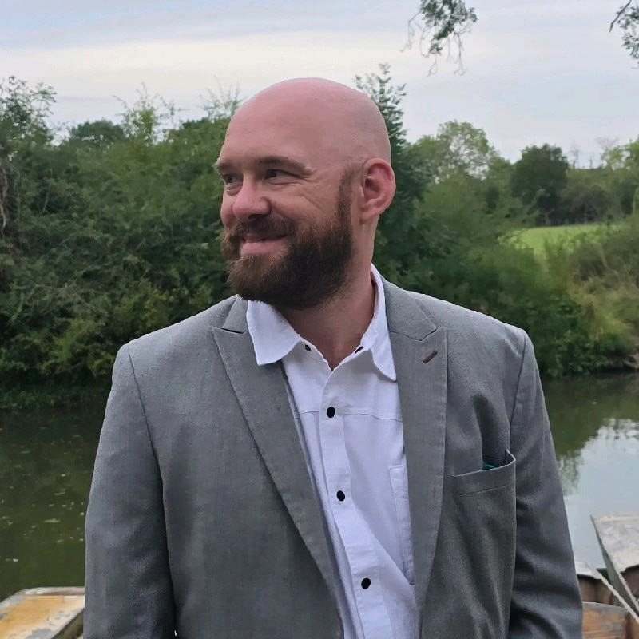

## Who are you and what do you do?

Hey, I'm John Cross, a Full-Stack Engineer at Santander UK. Some quick facts about me. I’ve had kidney failure since I turned 19 back in 2006. I spent a long time on dialysis, but I am now on my second Kidney Transplant. It has been a long road to get where I am now, so here we go.

My work is in Financial Support, where I work on two projects - ‘Digital Transformation’ and ‘Digital Journey’. In our transformation project, we’re developing new Debt Management Systems for use by Customer Agents. Developing customer solution portions of the system in Angular, integrating into some of our new API microservices. The whole system integrates with a third party, so we have a unique channel for the integration and development. Because of our distinctive infrastructure, our team is occasionally the first to introduce something new to the bank.

In our ‘Digital Journey’ project, we're supporting and developing backend functionalities that integrate into the Santander banking App. If you have an account, go into your account and click ‘More Options’, then ‘Financial Support’. The frontend guys do an amazing job to hit that sweet spot for Customer interactions. More features are coming soon, so plenty more work is in the pipeline. Soon we will have a function to help pay any arrears.

Outside of work, I love to get on the snooker table when I find the time with the limited hours in the week. In between (I know Jordan will love this), I am trying to learn Japanese.

In addition, I volunteer for Kidney Research UK as a community ambassador and Research Peer Reviewer. And very recently, I was announced as one of the new Mentors for the BCS Early Careers team to help early birds into industry. Somewhere, I find time for sleep as well.

## What first got you into tech?

I believe it all started when I was in Upper school, when desktops and the IT curriculum started. The boys and toys mentality kicked in. I published my first website back then in old school fashion, in MS Word. I had gone on to do courses in college. Halfway through, that's when the health problems started.

Through that time, I still had that urge to know more about how things worked. I began delving into hardware, building my first desktop, very exciting pushing that power button for the first time. Dipped into graphics design (Photoshop) for a period. This is when I began scripting in Lua a little bit for a plugin in an MMO game, and while I was playing the online game, this is where I met one of the future co-founders of Discord. He piqued my curiosity in software as he had a couple of products before he hit the jackpot. And to top it off, I got hooked on networking. It's safe to say I'm a bit of a Jack of all trades. Curiosity is the massive driver for discovering the functions of our world.

After my health got stable enough, with scares in between, I got myself back into College and University, breezing through. And the rest is history.

## What does your typical working day look like?

If every day had something in common, that would be coffee. The usual wake-up starts in typical British fashion with a good cup of tea. Making a coffee to go to get energised and travelling to work, either to my desk at home or the city view desk in the office in MK.

Typically, the day starts with our stand-ups, followed by Technical meetings with the team for delicate issues. All while consuming my precious one banana. Around 11, it's time for a refill, another dose of coffee.

My team utilises Pair Programming and TDD paradigm. After our morning meets, I connect with my pair and begin with the craftsmanship. We'll spend the next 2 - 3 hours working on our feature ticket. Sometimes we may have to pull our BA for any minor clarifications that we didn't pick up before.

Lunch is met with a visit to Spoons, Sizzlers, or Morrisons. The great thing about Sizzlers (Grilling Sizzles) is that the guy will seat us and give us the menu before picking them up again. He knows we'll order their amazing Chicken Biryani. When we eat, we get to talk about some of the crazy or magical things that've been happening in tech space. Sometimes brainstorming some idea initiatives. All the meanwhile, I am casually nudging my lead to move to Deno from Node.

Afternoons, we have a mix of meetings on different days encompassing planning and design meetings, KT sessions and finishing up with my pair. The day is gone before you know it.

## What’s your setup? Software and hardware. Pictures welcomed!

I'm caught at the time where I'll be moving at some stage soon (hopefully) so I have set up a temporary desk at home.

### Hardware

For work, I am using a 16” MacBook Pro M2. At Home, I have my own built desktop.

- Ryzen 7950X
- ASUS Crosshair Hero
- 32GB
- 3700 Ti
- Soundcore Q35
- Logitech Yeti GX

### Software

- IntelliJ Idea
- VS Code
- Github Copilot
- Handbrake (Occasionally do some video encoding)

## What’s the last piece of work you feel proud of?

It's hard to think of one. But if I had to choose one that probably had the greatest feeling was when I was at the crux of University.

Designing and delivering a new attendance system for a local nursery. Going out and doing research, and coming back with an engineering solution, was a feeling I felt proud about.

While discovering some of the marvels of frameworks out there, I had to decide what was best for the case. I decided to go with Laravel. A beautiful framework that packages everything, and I was only scratching the surface. My brain activated a new neuron, and I could start seeing new patterns and new semantics, giving me a burst of ideas that I wanted to do to satisfy that craving of an engineer.

## What’s one thing about your profession you wish more people knew?

Variable naming is the hardest thing!

Variable naming is hard because you’re not just naming a thing — you’re predicting the future, deciphering the past, and negotiating a peace treaty between you, your code, and every poor soul who’ll read it later.

It’s like naming a baby… except the baby will be raised by hundreds of developers, speaks five programming languages, and will haunt you in production logs at 3 AM.

Good variable names require you to know:

- What the code does (you don’t).
- What future devs will need (they won’t).
- How to explain it in a single, elegant, lowercase camelCase word (good luck).

That’s why developers spend 5% coding, 5% debugging, and 90% staring at a variable name whispering, “Who… are you?”

## Share with others something worth checking out. Not necessarily tech related. Shameless plugs welcomed.

As a walking example, please consider Organ Donation. The biggest message I can give is to talk with family/loved ones about your wishes.
