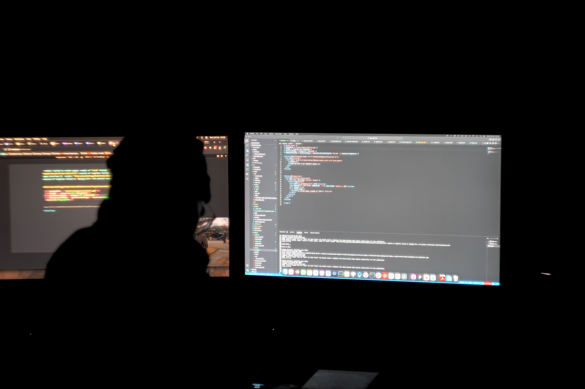
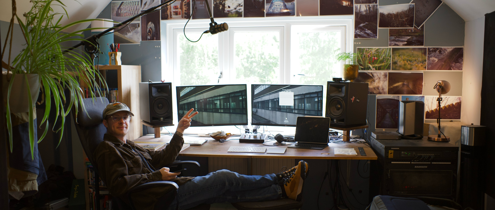
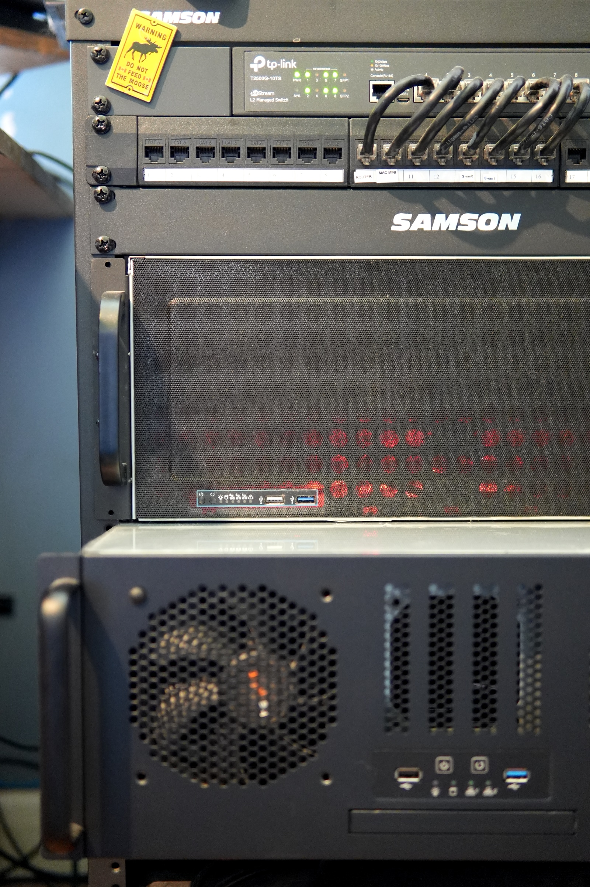

## Who are you and what do you do?

I am Jordan Legg, the founder and Chief AI Officer of takara.ai. Running the frontier and applied AI and ML teams, I like to think that I help build some of the most advanced technology on earth from right here in the sunny UK! There’s 5 core members that work with me a lot of the time—Mikus, Jacob, Lain, Joseph and Eswar. The other 10-15 are community members from around the world. In the applied AI/ML on customer projects there’s approximately 4 AI engineers at any one time. My main focus right now is on customer projects and supporting our ongoing work building our distributed text embedding network designed at bringing low latency embeddings far closer and cheaper for end users (announcement soon).

## What first got you into tech?

Minecraft. I wanted to build better servers that offered my mates and I a better experience playing the game together on my parent’s horrendously bad 2 Meg down and 0.2 Meg up connection. So I had to learn a bit of Java to make the game run with less overhead, it was then I learned to hate Java and I haven’t used it since I was 14. But I’ve always been into taking things apart and putting them back together, whether it was computers, cars or furniture—I like to think I just chose to reassemble tech instead as a career path. I got into it for a living in my first company IA Intelligence Analytics building AI software for B2B sales and marketing leads. My dad was a sales director at IGXGlobal and tasked me in trying to connect their products to people that wanted them using social media data, it paid off big time and allowed me to start my next venture takara and not take a salary for an entire year before takara went profitable. That was when I was 19 and now I’m 26, flown by. I made a few shitty Wordpress sites before that, we won’t talk about PHP.

## What does your typical working day look like?

Up at approx 08:30am (I am not a morning person at all), standups at 08:45 and 09:00 for our projects, code/linkedin/calls till lunch, eat then back to work until about 5PM. After 5 I work on open source and research projects with the FRT that’s across the globe until whatever time I get tired—sometimes it’s 10PM, sometimes it’s 5am. Being a business owner this is a very loose schedule, we have board meetings, flying to countries and visiting events that I have to do as well that doesn’t really fit this model so it’s not good if you like a routine. It’s chaos managed by coffee, I’m remote, I have a Tailscale VPN so I can access my setup around the world which I’m frequently doing more of so it’s been very helpful, thanks Hal! You’ll be a major help this year! I’m not sure I balance it well, I burned out Nov/Dec time in 2024 and still wrote a scientific paper at 5am over Christmas.

## What’s your setup? Software and hardware. Pictures welcomed!

2018 Mac Mini, 27-inch screens x2, 1st gen MacBook Pro M1, M1 iPad Pro, Sauron and Hal the storage and slave server combo sporting 15x SSD array, 24 cores, 10gig bandwidth, a RTX 2080 Ti GPU, 64GB memory combined in the rack across 2 4U cases serving as my home data science cluster, fully networked not a single wireless with an L3 switch and LACP to Sauron the storage array. Cursor, Vercel, Hugging Face, Python, Golang and Typescript. Nothing to add here, I’ll attach pictures.

## What’s the last piece of work you feel proud of?

For sure it was our hackathon track win in Paris, building a software solution to help people vibe code better was super awesome and I am super proud I spearheaded the team to a victory there. Try it out at vibe.takara.ai. It was an app, it had a leaderboard and lots of amazing things to help users prompt engineer better code out of LLM’s. I brought Jacob with me from the UK and met Joseph there, two very good members of the FRT. I learned there is a limit to my tiredness which kicked in way before Jacob that kept working well into 3am, thank you brother.

## What’s one thing about your profession you wish more people knew?

AI is full of experts right now which means nobody is, stop listening to fucking twitter and TikTok and get closer to the real shit that’s happening every day on Hugging Face, Daniel Han, Tom Arsen, Clem Delangue—these are people that have built software you don’t even realise you use every day and that shit works. It’s a fast-paced and noisy time right now so it’s hard to cut through the marketing crap. I would say just get stuck in and start building, it’s the best way.

## Share with others something worth checking out. Not necessarily tech related. Shameless plugs welcomed.

Honestly, our [tldr service is really cool at tldr.takara.ai](https://tldr.takara.ai/), check it out every day to summarise the daily cohort of crazy AI papers totally for free, saves hours of your life if you want to be at the edge. Artificial Analysis is a great website for comparing generative models across every facet, I reach for it before every project.
