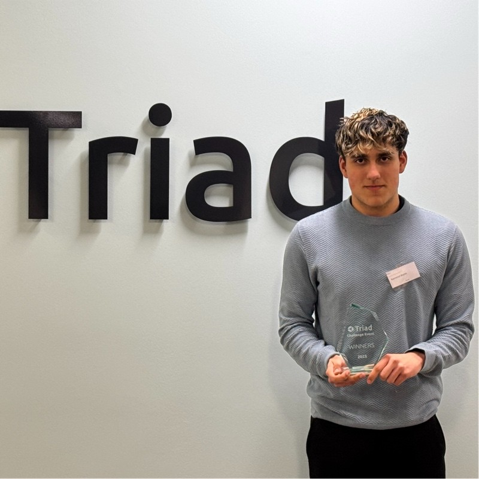
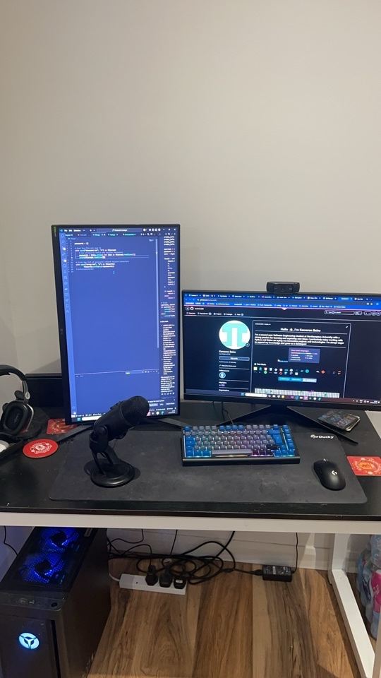

## Who are you and what do you do?

My name is Kameorn, and I am a Software Engineering student at the University of Northampton. I'm really enjoying my time at university, meeting lots of new people, and taking on the role of Course Representative. I’m originally from Royal Leamington Spa, and my first work experience was at McDonald's and as a Sales Assistant at Millets. These roles helped me develop my confidence, communication skills, and ability to work in a fast-paced environment.

## What first got you into tech?

Ever since my uncle introduced me to the Nintendo Wii when I was six, my journey into tech began. I’ve always had a passion for gaming, spending countless hours playing with friends and having fun.

My first experience with coding was when I was 13—if you don’t count Scratch or Redstone as programming languages! I started with Python, and at first, I was completely confused by it. But I was determined to learn, and that led me to develop some basic games like Pong.

When I got to university, I was exposed to so many different areas of tech, which only fueled my passion for learning even more.

## What does your typical working day look like?

As a student, my day is packed with lectures—both on campus and online—where I engage with the material and complete assigned activities.

I'm very much a morning person, so my day starts at 6:30 AM. I begin by checking emails and university announcements, making sure I’m up to date. As a group leader, I also review my team’s work and send out any necessary messages to keep everything on track.

Fitness is a big part of my routine, and I try to hit the gym at least five times a week. I even enjoy watching a bit of anime while on the treadmill—it makes cardio way more fun!

When I get back, I usually focus on assignments, whether it’s working on a mobile application or web development projects. In my spare time, I like to unwind with some gaming, usually playing Rainbow Six Siege with friends to end the day on a high note.

## What’s your setup? Software and hardware. Pictures welcomed!

### Hardware looks like:

- PC: Lenovo Legion T5 26AMR5
- Keyboard: Ducky Project D Tinker 7%
- Mouse: Logitech G Pro Superlight 2
- Microphone: Logitech Blue Yeti
- Monitors:
- Primary: LG UltraGear 27GP85OP
- Secondary: MSI 27" G2712F
- Webcam: Logitech C920
- Headphones: Astro A30

### Software looks like:

- IDE: Visual Studio Code
- Video Editing: DaVinci Resolve
- Version Control: GitHub

## What’s the last piece of work you feel proud of?

I developed an all-in-one gym application in Java for an assignment, where users can track their food intake, monitor their weight, and set fitness goals. This project was especially meaningful to me because I use it daily to stay on top of my health and fitness.

Not only did I enjoy developing it, but I’m also really proud of how practical and useful it turned out to be!

## What’s one thing about your profession you wish more people knew?

One thing I wish more people knew about the tech profession is how much of a community it is. It’s not like the stereotypical image of just sitting alone, typing away all day. In reality, the connections you make are incredible—whether it’s collaborating on projects, learning from others, or participating in meetups and online communities.(Like NN1 Dev Club) Tech is all about sharing ideas, solving problems together, and supporting one another.

## Share with others something worth checking out. Not necessarily tech related. Shameless plugs welcomed.

Check out [my portfolio website](https://kam-bains.com) to see some of my work and projects. Also, if you're into fitness, I share [my fitness journey and tips on TikTok](https://www.tiktok.com/@kamshredz), where I try to help others stay motivated and improve their fitness.
