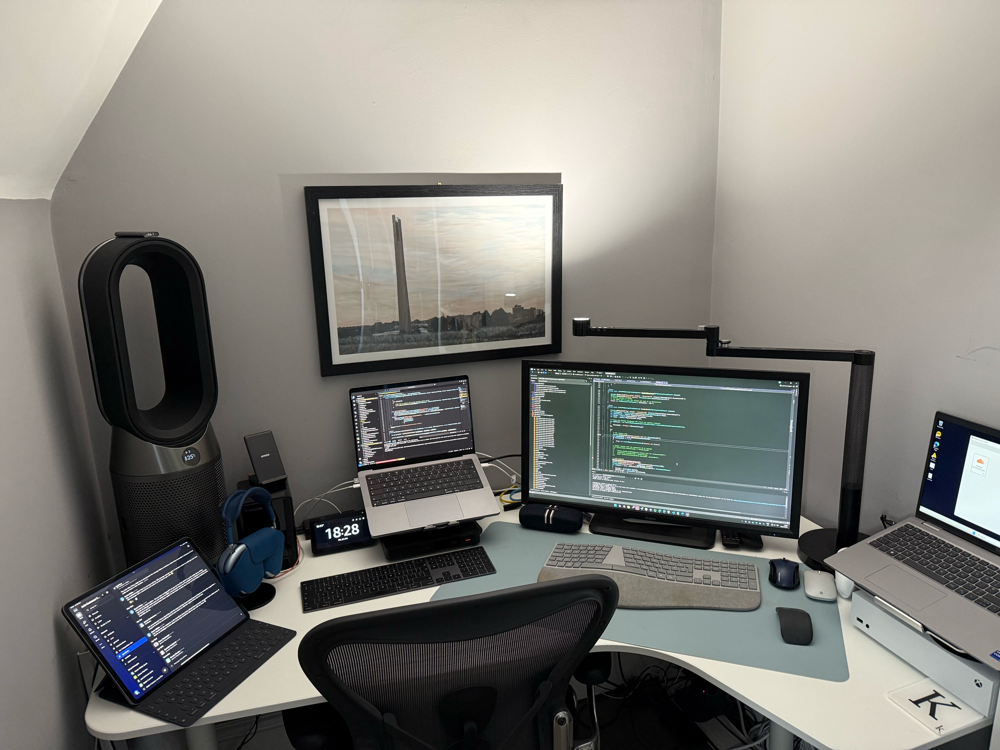

## Who are you and what do you do?

I'm Kevin, Software Engineering Manager at West Northants Council. We have an IT team of over 200, a Digital Team of 30 and a Development Team of 11 - so we're a small cog in a very large machine. We develop and support the councils websites, CRM, mobile apps, chatbots, AI's, integrations and automations. We have coders (C# and PHP primarily, but still have 50k lines of Java, 400 Node and Python Lambda's running) running on mainly AWS, but also Platform.sh, a little Azure and some API's from GCP - plus we still have our own data centers! We also have low-coders, which are our growth area these days using Jadu (a big supplier in our sector) for CRM and Forms, along with OutSystems and are dabbling with the Power Platform.

## What first got you into tech?

I started coding in 1981 when I received Sinclair ZX81 for my eleventh birthday, in those days coding took patience, there were no hard disks or any other mechanism to save code. You wrote it from scratch every time, either from an idea in your head or from a listing you found in a magazine. Every day you'd start afresh with a blank slate. Every day was a new adventure, how can you not fall in love with it? My first professional coding job was in 1988 writing COBOL on an ICL2900 mainframe. Professional developers then didn't even have the tech that people had in their homes - we didn't have direct access to computers. My desk consisted of a pencil, some paper and a phone. We wrote code by hand on the paper, it was entered into the computer by typists, compilations happened overnight, so every mistake was a 24hr wait to fix. Running your code required submitting it to the people who had access to the mainframe - the Operators as they were called - who would run the code on your behalf and you'd get the print out of results the next day. So again, each run of your code when it was compiled was a 24hr wait for the results. It taught you patience, being able to write code that would compile first time and to be able to run the logic in your head rather than on a computer. Skills no longer needed.

## What does your typical working day look like?

I've had the same routine for the last 40yrs aside from the addition of some modern tech. I start to wake up at 0300, check there's no tech issues at work needing resolving, get out of bed at 0330. Exercise for four hours until 0730, home and working by 0800. As a manager there's normally a couple of hours of meetings a day doing managery type things. Then I get to do the fun stuff, working primarily with my fellow devs and colleagues from across our IT service to deliver innovation to the council, keep the existing services running and ensuring our projects are on track. Most of my time is tech related, not necessarily coding, but I'm still given opportunities to code on a regular basis. I love my job and as is said 'when you start doing what you love to do you'll never work another day in your life' so by that token, I've never worked a day in my life and proud of it. Anyway, I got off track there - finish work around 1800. Dinner with the family (four sons, three of whom are developers), a little bit of TV with my wife and then in bed by 2000 looking forward to the next day.

## What’s your setup? Software and hardware. Pictures welcomed!

Primarily a 2023 MacBook Pro with an M2 Max processor - all the local computing power a dev needs, an inherited monitor from one of my sons, a Microsoft surface ergonomic keyboard with a nice velvety wrist rest and a funky Microsoft surface arc mouse. The MacBook runs both MacOS and Windows together (via Parallels) so I can support our team who have a mixture of Windows and MacOS hardware. Personally, it's Windows, C# and Visual Studio for the IDE, plugged into AWS as our primary cloud and Amazon Q as my AI buddy to assist me with coding and general techie stuff that I'm too lazy to search for.

## What’s the last piece of work you feel proud of?

Oddly I don't get proud about the tech itself anymore. We're a slightly different breed of developers in that we're generally more local government experts who know how to code rather than coding experts who know how local government works. We don't work for the highest wages or the coolest sounding projects, but everything we do matters. People don't contact the council because all is good in their life, they contact us because they have an issue. We work night and day using technology to help resolve their issues as quickly and cost effectively as possible. We don't expect people to thank or even appreciate the work we do, it's our job to get out of their way and let them get back on with their lives. When we can do that, when they don't even notice or think about us - that makes me proud. We've always room to improve, we are far from perfect, but I'm proud of the work I do, our team does and what the council aims to achieve every day.

## What’s one thing about your profession you wish more people knew?

Bins - arguably the least exciting thing in anyone's life, but as is evident when they're not collected - it becomes national news. All the latest tech you read about supporting all the cool companies out there - we have to support bins. From traditional servers and filestore, through to microservices, message buses, CDNs, mobile apps and AI. We have around a hundred microservices and four million messages on our message bus relating to waste every month co-ordinating the service and 99% of the time it just works, quietly doing it's thing to keep your bins being collected and our streets clean.

## Share with others something worth checking out. Not necessarily tech related. Shameless plugs welcomed.
