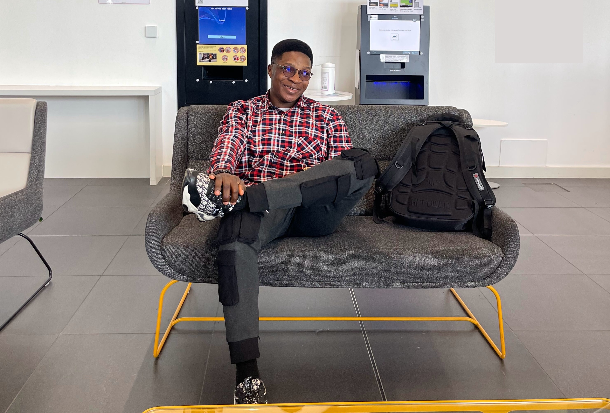
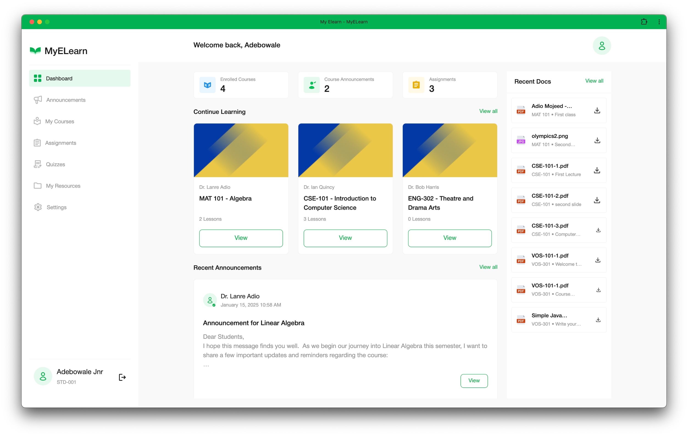

## Who are you and what do you do?

Hi, I’m Mojeed, also known as "codeLeaf🥑" across my socials. I’m a frontend software engineer who transforms ideas into creative and functional digital experiences. My work revolves around modern web technologies, user-centric design, and building solutions that genuinely solve real-world problems.

I’m passionate about tech communities and have led developer groups in the past, with highlights in the Google Developer Groups (GDG) and Google Developer Student Clubs (GDSC/GDGoC) programs.

I recently completed my master’s degree in Software Engineering at the University of Northampton, graduating with distinction. My thesis focused on improving learning management systems for Nigerian institutions; a topic I’m deeply passionate about. Professionally, I enjoy contributing to projects in AI, FinTech, HealthTech, EduTech, E-Commerce, and SaaS.

When I’m not coding, you’ll likely find me contributing to tech conversations, writing, listening to music, or exploring new technologies to stay on the cutting edge of web development.

## What first got you into tech?

My tech journey began in 2018 after my first year in university. The GDSC programme had just been introduced on campus, and coming from a background in graphics and art, I was immediately drawn to the creativity and problem-solving in tech.

I initially started with IoT systems, but the lack of visual creativity made it feel limiting for me. With my love for aesthetics, I naturally gravitated toward web development, where I could blend logic with design and build beautiful user interfaces.

My background in electrical and computer engineering meant I began with Python and C for embedded systems, but over time I realised I found more joy in crafting UIs than computer architectures. A supportive circle of developer friends also motivated me and helped me see my potential.

Receiving my first tech paycheck sealed the deal. That moment was the confirmation I needed; I knew this was the career path I wanted to build for myself. 😅

## What does your typical working day look like?

I currently work remotely from the UK, so my routine shifts depending on timezone differences and daylight savings. Before winter, my day started around 8am, but now I start as early as 6am.

The first few hours are usually filled with stand-ups, team syncs, and resolving blockers from the previous day. We also plan deliverables and ensure alignment across the team.

As a frontend engineer, my day revolves around:

- Building and refining user interfaces

- Syncing with backend teams on APIs, requirements, and integration

- Working with QA teams to ensure features match defined test cases

- Resolving tickets from customer support teams

- Meeting with PMs biweekly for sprint planning and retrospectives

After work, I spend time catching up on global tech and life updates, handling personal projects, or diving into new learning.

## What’s your setup? Software and hardware.

I prefer a clean and efficient setup. My workspace includes:

### Hardwares

- 14” MacBook M4 Pro
- 13” MacBook M1 Pro
- 27” external monitor
- Logitech MX Anywhere 3
- Headphone
- Ring light
- Phone holder for video recordings

### Day-to-Day Softwares

- VS Code
- GitHub Desktop + GitHub Copilot
- Slack
- Figma
- Postman / Apidog
- Jira

Still looking forward to improving my setup. Open to any suggestions too.

## What’s the last piece of work you feel proud of?

It’s tough to choose because I’m genuinely proud of everything I build, but the standout project has to be my final master’s dissertation project.

I created a full-scale Learning Management System aimed at addressing long-standing issues in LMS platforms commonly used in Nigeria, such as poor user experience, lack of accessibility, inefficient assessment workflows, and security concerns.

My system introduced:

- A more intuitive and modern UI

- Improved online examination flow

- Enhanced analytics for educators

- Better course management structure

- Secure authentication and role-based access

- Responsive design that works smoothly across devices

This project wasn’t just academic, it was personal. I’ve seen firsthand how outdated systems frustrate students and educators, so creating a solution that genuinely improves learning experiences meant a lot to me. You can check out the project on [Github](https://github.com/Adiomojeed/my-elearn-fe). You can also find the links to some other projects I have worked on below:

- [Mainstack](https://mainstack.com/)

- [Green Africa](https://www.greenafrica.com/)

- [Dojah](https://dojah.io/)

- [Muzu](https://muzu.co/)

## What’s one thing about your profession you wish more people knew?

Tech isn’t just about knowing how to code, it’s about problem-solving and understanding people. Every website, API, backend service, or UI was built to solve a real challenge.

The best engineers aren’t the ones who know the most languages, but the ones who think critically, collaborate well, and stay curious.

Also, tech is not a get-rich-quick scheme. Many people come into tech believing they’ll start earning massively in a few months. In reality, it requires dedication, consistency, and a genuine passion for learning.

## Share with others something worth checking out.

1. **[Replit](https://replit.com):** I recently created my [portfolio](https://codeleaf.vercel.app) on Replit during a vibe-coding session. Tools like Replit show how quickly AI is transforming software development. AI can help accelerate work, but it still produces redundant or inefficient code. So, the expertise of a real engineer is still very important.

2. **Local communities and meetups:** Whether it’s tech, arts, entrepreneurship, or creative spaces, showing up where people learn and build together can truly change your life. Some of my biggest opportunities came from simple conversations at community events.

Cheers!!!🚀
