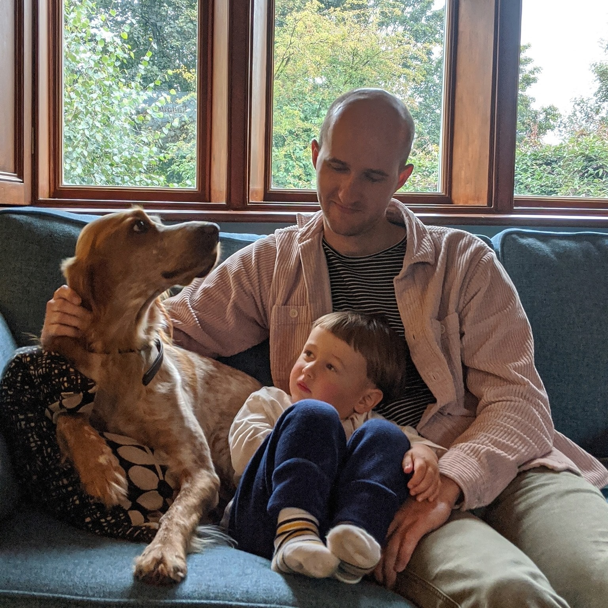
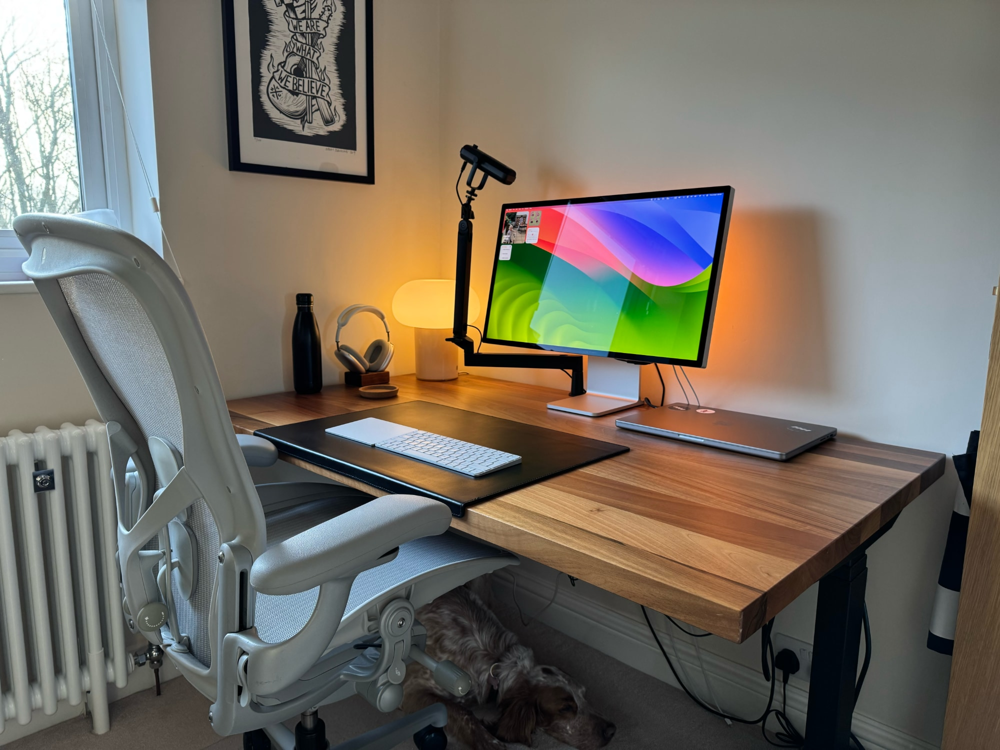
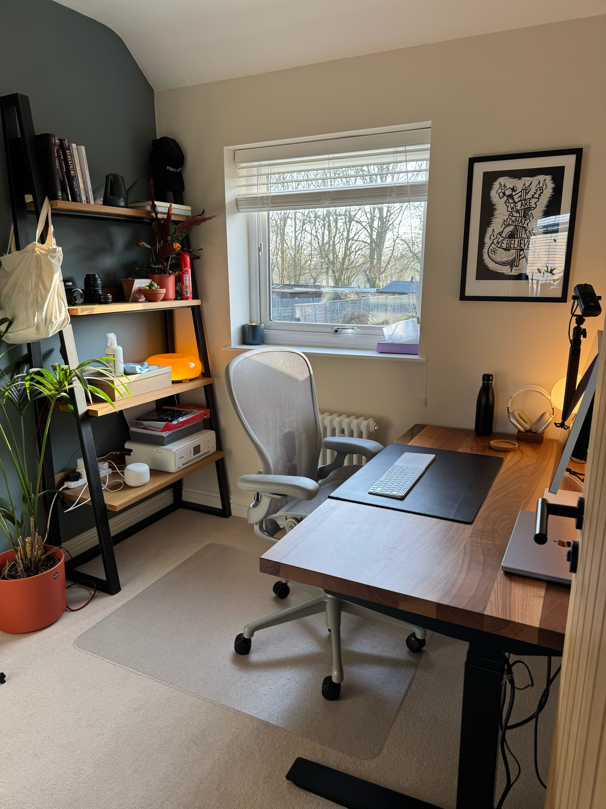
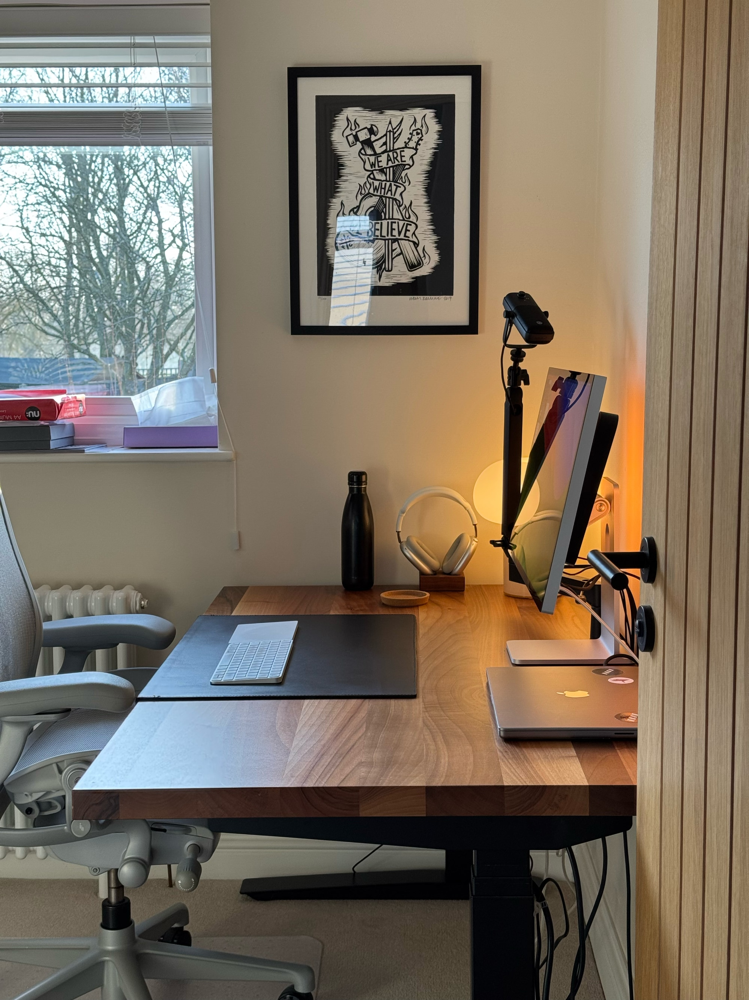

## **Who are you and what do you do?**

My name is Oliver. I live in Rushden, Northamptonshire with my partner, two boys, and dog. I'm also a software engineer with a passion for the web.

For the past 8 years I've been working at [Unsplash](https://unsplash.com/) as the team lead for the Web team. Before that I worked at [The Guardian](https://www.theguardian.com/) where I helped to develop a new content management system and various improvements to the public website.

## **What first got you into tech?**

When I was a kid, I discovered that anyone could create a web page and share it with anyone, whether that's friends at school or someone on the other side of the planet. I found this fascinating.

I first put this to good use by creating a website for my brother's skateboarding team, using Microsoft FrontPage and various hacks like using HTML tables for rounded corners.

Later I fell in love with an online game called Habbo Hotel, and I created a fansite which became quite popular. It even had a radio station! This was when I first discovered PHP, and my love for the web continued to grow from there.

At university I spent all of my free time trying to build this idea I had for an [RSS feed reader with social features](https://vimeo.com/69376016). It was a process of trial and error. On my third or fourth attempt I had something that I was reasonably happy with. It served as my dissertation, but regrettably I never shipped it. One day, when the kids are older, I hope to reignite my passion for side projects like this.

## What does your typical working day look like?

I get up with the kids around 6am, have breakfast and spend some time with the family.

I work from home, either from my small home office, the dining room, or when the sun is occasionally shining, the garden. I usually start work at 8am and finish around 5pm, although with half of my team being on the east coast of America, I'm sometimes pulled into things later in the evening. The days can be quite long, but I enjoy it.

A typical day at Unsplash involves coding, pair programming, and 1-to-1s with my team. My time is split between technical improvements and helping the team to develop new features for the site. With the codebase being a decade old now, it's a challenge keeping it up to modern standards. Front-end development is an unsolved problem, and there's a lot of churn in the ecosystem whilst the industry attempts to figure that out.

After sitting down all day I like to take the dog for a walk at the end of the day, to burn off her energy and stretch my legs. I'm usually accompanied either by my son or a podcast (my favourite is [ShopTalk Show](https://shoptalkshow.com/)).

## What’s your setup? Software and hardware. Pictures welcomed!

Software: lazygit, VS Code, Raycast, Linear, TypeScript, React.

Hardware: MacBook Pro, Studio Display, AirPods.

## What’s the last piece of work you feel proud of?

At Unsplash we had a lot of hairy code around making requests to our API, defining TypeScript types for API responses, and generating mock responses. We recently reverse engineered all of this knowledge into an OpenAPI specification from which we can generate a lot of things: API clients, types, mock responses, documentation, etc. It's cleaned up a lot of code, and now we have a much better tool for collaborating with the API team.

## What’s one thing about your profession you wish more people knew?

A lot of people think coding isn't for them because they're not clever enough nor good at maths, but you don't need to be clever. All you need is passion and perseverance. [Frank Turner's music](https://www.youtube.com/watch?v=SVx2RuANAyk) taught me this.

## Share with others something worth checking out. Not necessarily tech related. Shameless plugs welcomed.

I mentioned lazygit earlier, but I want to mention it again because it's helped me so much. If like me you're familiar with the Git CLI and how laborious simple things can be (e.g. amending a previous commit), [watch this video](https://www.youtube.com/watch?v=CPLdltN7wgE) and fall in love.

Whilst I was writing this I also rediscovered [a kinetic typography video](https://vimeo.com/38383326) I made for a university project. It's rare that I still feel proud of something I made that long ago. If I had more time, I would love to do more things like this.
