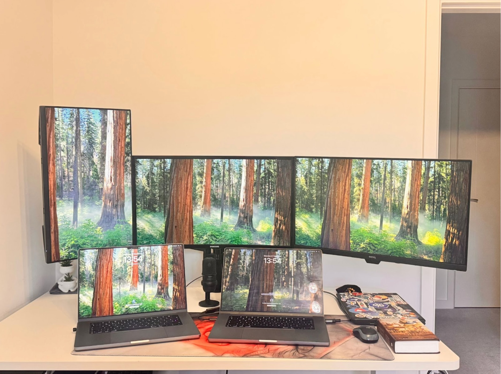

## Who are you and what do you do?

My name is Rahulkrishnan R A. I was born and brought up in Kerala, India, and I’ve been living in the UK since 2018. I’m currently based in Northamptonshire, where I live with my wife.

My current roles include Senior Platform Engineer, Open Source Contributor, and Cursor Ambassador for the UK Developer Community. In my professional role, I currently work as an Assistant Vice President (AVP) at Barclays, where I contribute to building and operating large-scale, reliable platforms within a complex enterprise environment. Beyond titles, I see myself as a builder of platforms, communities, and intelligent systems, with a strong passion for creating new things in technology and solving real-world challenges.

Professionally, I work at the intersection of platform engineering, cloud-native infrastructure, and Agentic AI. Over the course of my career, I’ve gained experience across multiple companies and domains, which has helped me develop a strong systems mindset—balancing scalability, reliability, security, and developer experience.

My journey has included founding an early-stage startup, Zaagpro, contributing to major Open Source projects such as Debian and OpenEBS, and helping organizations design scalable, reliable engineering platforms.

The experience I gained through entrepreneurship has been deeply formative. Running a startup strengthened my ability to identify opportunities, think in terms of impact, and collaborate effectively to solve complex problems. That entrepreneurial mindset continues to shape how I work today—especially when building systems that require both technical depth and cross-functional collaboration.

Today, my primary focus is on Generative AI, alongside modern platform engineering. I regularly deliver technical talks and workshops across meetups and communities, sharing practical insights on cloud, Kubernetes, and Agentic AI.

Community building is a core part of who I am. I’ve initiated and grown developer communities in both India and the UK, including Kubernetes meetups. I also actively attend meetups and conferences, which have helped me build strong relationships with passionate people across the ecosystem. These connections have consistently motivated me to give back through volunteering and community contributions.

Alongside tech communities, I’ve also volunteered with organisations such as the Lions Club Milton Keynes, contributing my time and effort to broader social initiatives.

At heart, I’m driven by a simple purpose: to build meaningful technology, simplify complexity, and collaboratively solve real-world problems while creating long-term value through engineering, leadership, and entrepreneurship.

## What first got you into tech?

What first got me into tech was curiosity and a strong desire to solve real-world problems by building things.
I’ve always been drawn to understanding how systems work and how ideas can be transformed into practical solutions through technology. That curiosity naturally led me into computer science and early in my career to building software and platforms that addressed real customer needs.

A defining moment was co-founding my first startup in 2012, where I experienced firsthand how technology can create tangible value for businesses and users. Working closely with real problems, taking ownership, and continuously learning showed me that technology is not just about tools—it’s about helping people and creating impact.

Over time, this passion evolved beyond building systems to also supporting and mentoring others. I find great fulfillment in sharing knowledge, guiding engineers, and enabling teams to grow through technology.

That same curiosity continues to drive me today—whether I’m working on platform engineering, Open Source, or Agentic AI—always focused on building systems that help people work better, faster, and smarter.

## What does your typical working day look like?

My typical working day starts early—usually around 6 a.m., and often earlier. I value the quiet of the morning and use this time intentionally for learning, reflection, and gratitude. This often includes reading, experimenting with new tools, light mental exercises such as chess, and a short gratitude practice to begin the day with clarity and focus.

During the workday, particularly when I’m in the office, I focus on solving complex technical problems, collaborating closely with my team through discussions and design conversations, and contributing meaningfully to ongoing projects. I place strong emphasis on clear communication, ownership, and maintaining a positive and collaborative working environment.

In the evenings, I prioritise physical fitness, spending time at the gym to build consistency, energy, and discipline. I also make a conscious effort to spend quality time with my family. I’m also passionate about cooking, and I enjoy experimenting with new recipes—it’s a creative outlet and a way to relax after a focused workday.

Outside of work, I balance my technical focus with creative pursuits, including street dance and mural art, which help me reset mentally and maintain a healthy creative balance. One highlight I’m particularly proud of this year was performing a dance programme at the Diwali celebrations in Northampton town centre, which was a meaningful way to contribute to the local community beyond technology.

Overall, my days are a deliberate blend of continuous learning, structured problem-solving, physical well-being, relationships, creativity, and community engagement, helping me stay grounded and effective both professionally and personally. I maintain an active creative practice as a professional dancer and artist, which supports focus, creativity, and long-term growth.

## What’s your setup? Software and hardware. Pictures welcomed!

### Hardware looks like:

- MacBook Pro 16-inch, M1 Max - 64GB Memory
- MacBook Pro 16-inch, M2 Pro - 32 GB Memory
- Monitor - Samsung C27F396FHU
- Monitor - Dell P2422H
- Monitor - BenQ GW2780-T
- Hyperx Microphone

### Software looks like:

- Cursor
- Visual Studio Code
- DaVinci

### Programming Languages:

- Golang
- Python
- Ruby
- Javascript

## What’s the last piece of work you feel proud of?

One of the most recent pieces of work I feel proud of is the impact I’ve made through community building and technical enablement.

Over the past year, I’ve focused on combining hands-on engineering experience with knowledge sharing, delivering technical talks and sessions that help engineers better understand cloud-native platforms, developer tooling, and modern engineering practices. Seeing practitioners gain clarity and confidence when working with complex systems has been especially rewarding.

In parallel, I’m proud of the communities I’ve helped grow, particularly through my role as a Cursor Ambassador in the UK, where I’ve worked to create inclusive spaces for learning, collaboration, and experimentation. Supporting initiatives such as meetups, internal knowledge-sharing sessions, and planning a community hackathon has reinforced the importance of strong, connected developer ecosystems.

What makes this work meaningful to me is the opportunity to create long-term value—through people, platforms, and shared knowledge—rather than short-term technical wins.

## What’s one thing about your profession you wish more people knew?

One thing I wish more people understood about my profession is that it extends far beyond writing code or adopting new tools.

Work in platform engineering, OpenSource, and Agentic AI is fundamentally about designing reliable systems that enable people and teams to perform at their best. Much of the impact is intentionally invisible—successful platforms reduce friction, improve consistency, and create the conditions for sustainable innovation.

It also requires a long-term mindset. Professionals in this space must balance experimentation with stability, speed with governance, and innovation with responsibility. When done well, the outcome is not just better technology, but greater organizational resilience and developer effectiveness.

Ultimately, this profession is about amplifying human capability through thoughtful system design, not technology in isolation.

## Share with others something worth checking out. Not necessarily tech related. Shameless plugs welcomed.

- [My Instagram Cooking Channel](https://www.instagram.com/couplespan)
- [Talks & Slides](https://speakerdeck.com/rahulkrishnanfs)
