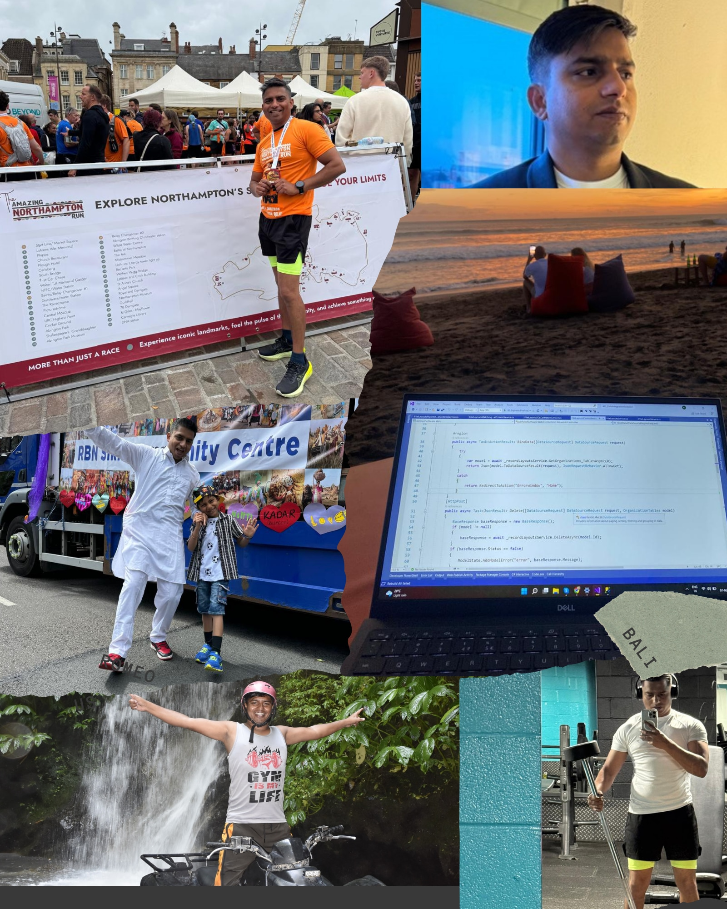
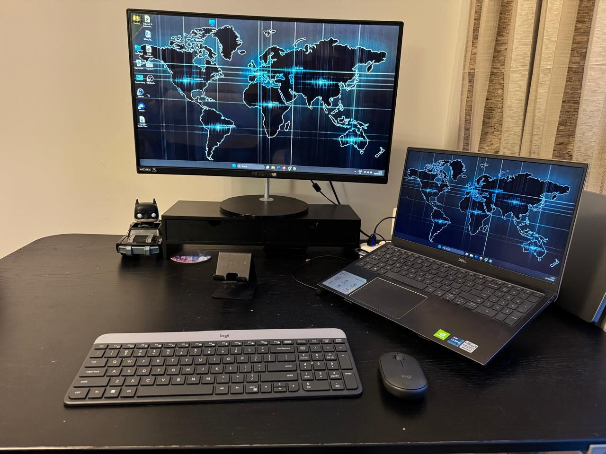

## Who are you and what do you do?

I’m Ravinder Singh. I was born and raised in Fatehpur, a small village in Hoshiarpur, Punjab, India. Growing up in a place where exposure to technology was limited, I went on to become the first software engineer from my village—something I’m incredibly proud of and which continues to motivate me to inspire others from similar backgrounds.

Since 2023, I’ve been living in Northampton, UK, with my wife and two kids.

Professionally, I’m a Systems Developer with over 15 years of experience building scalable, enterprise-grade software solutions. I currently work at Shoosmiths LLP, Northampton, where I design and develop internal platforms using ASP.NET Core APIs, Blazor, SQL Server, Azure, and modern architectural patterns.

While my official title is Systems Developer, I consider myself a solution architect at heart. I enjoy designing software as complete, long-term solutions and implementing them across both backend and frontend.

I’m always keen to learn new technologies. Recently, I’ve been exploring ML.NET, a free, open-source, cross-platform machine learning framework from Microsoft that allows developers to build and integrate ML models using C#. I also use Cursor AI to speed up development and improve code quality—especially for refactoring, prototyping, and validating implementation approaches.

Outside of work, I enjoy giving back to the community and staying active. I regularly volunteer at the food bank at RBN Gurdwara Sahib in Northampton, supporting those in need. I’m also a passionate runner and have completed The Amazing Northampton Run half marathon twice, which keeps me motivated both physically and mentally.

I love travelling and have visited Goa, Bali, Thailand, Frankfurt, London, Scotland, and most recently Toronto—experiences that broaden my perspective and inspire creativity both in and outside of work.

## What first got you into tech?

Curiosity was the spark. I still remember being in 9th grade, the first time I got hands-on experience with a computer. I was using MS Paint, experimenting with simple drawings, when I asked my teacher a question that changed everything for me: “Who created this MS Paint thing?”

My teacher replied, “Software developers—they build these kinds of things that run on a PC.” That single answer opened a whole new world for me😊, from that moment, my curiosity turned into a deep interest in understanding how software is created and how it works behind the scenes.

That curiosity led me to learn my first programming language, FoxPro, and once I wrote my first program, I was hooked. What started as simple experimentation soon became a passion for building solutions that solve real-world problems. Even after 15+ years in the industry, that same curiosity continues to drive me to learn, improve, and explore new technologies.

## What does your typical working day look like?

A typical day for me is a balanced mix of problem-solving, collaboration, and hands-on coding (with coffee ☕). I spend a significant part of my time designing and implementing backend logic and APIs, while also working with Blazor and web frontends to ensure seamless user experiences. I also do database designs to keep systems performant and scalable.

Code quality is important to me, so I review pull requests, refactor where necessary, and continuously look for ways to improve maintainability. I also collaborate closely with stakeholders (Team lead, Project Manager) to understand requirements and translate them into effective technical solutions. Alongside this, I enjoy mentoring team members and sharing best practices, helping to build a strong and collaborative engineering culture.

I also spend time experimenting with new tech—whether it’s improving internal utilities, exploring Azure services, or building side projects to sharpen my full-stack and ML skills.

## What’s your setup? Software and hardware. Pictures welcomed!

I prefer a clean, distraction-free setup that helps me stay productive, whether I’m working from the office or from home.
Hardware

- High-performance Windows PC
- Large external monitors (essential for working across backend and frontend)

I work in a hybrid setup:

- Office: Windows laptop with dual HP monitors, a wide desk, and a small plant to keep the space lively
- Home: I connect my work laptop to a large monitor, and for personal learning and experimentation, I use a Dell laptop with a large screen

Software:

- Visual Studio & VS Code, SQL Server Management Studio
- MS Team, Discord
- GitHub & Azure DevOps
- Cursor AI, MS Copilot and ChatGPT
- Browser with far too many tabs 😄

I find that clarity beats complexity when it comes to staying productive and focused.

## What’s the last piece of work you feel proud of?

Over my 15+ years in the industry, I’ve worked on many applications and systems, and I’m proud of everything I’ve contributed to.
Recently, one project that stands out is RoPA, a GDPR compliance web application at Shoosmiths. I contributed to its architecture, database design, and a clean layered architecture.

The RoPA web app significantly improved maintainability, reduced report generation time, and standardised coding practices across the team. Seeing a complex compliance process become streamlined, reliable, and automated was incredibly satisfying.

I’m also proud of a custom database utility I built, [RS.Dapper.Utility](https://www.nuget.org/profiles/ravinder25886) (NuGet link), lightweight library, built on top of Dapper, simplifies and standardises database operations across MSSQL, PostgreSQL, and MySQL.

## What’s one thing about your profession you wish more people knew?

Many people think software development is just about writing code, but it’s much more than that.

A big part of the job is understanding the business problem—what users really need and how the system will evolve over time. Creating good software involves constant trade-offs between speed, quality, and scalability.

It’s not about showing off clever tricks or writing fancy code; it’s about designing systems that last and writing code that other developers can understand years later. Good software comes from clear thinking, thoughtful planning, and a focus on long-term impact.

My advice to anyone in the field is simple: keep learning. Technology evolves fast, and today it’s especially important to learn

## Share with others something worth checking out. Not necessarily tech related. Shameless plugs welcomed.

- [Microsoft Events: Great for free learning sessions and community events](https://shorturl.at/TtDCa)
- [Milan Jovanović (Microsoft MVP): Practical .NET and software architecture insights](https://www.linkedin.com/in/milan-jovanovic/)
- [ML.NET GitHub: Official repository for Machine Learning](https://github.com/dotnet/machinelearning)
- I like to share things that inspire or help others, both in tech and beyond. I regularly post blogs on [my website](https://www.theravinder.com/blog), where I write about software development, learning new technologies, and personal projects.
- Outside of work, I like to share glimpses of my personal life and hobbies on [Instagram](https://www.instagram.com/ravinder25886/) and post videos I create in my free time on [YouTube](https://www.youtube.com/@TheRSVisuals).
