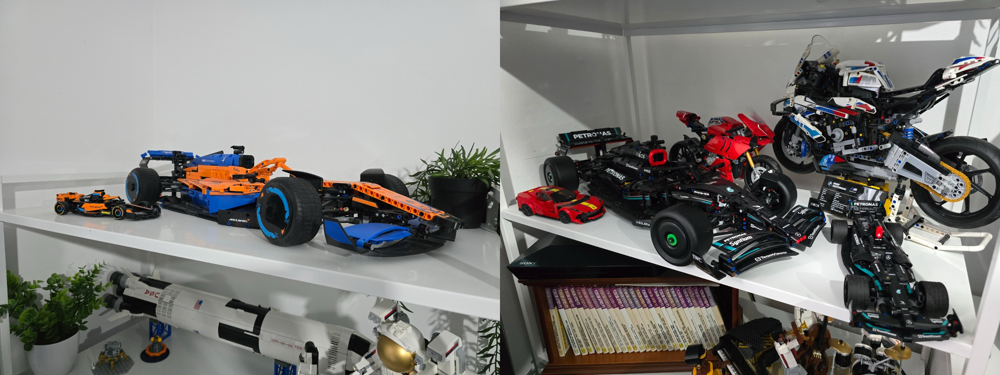
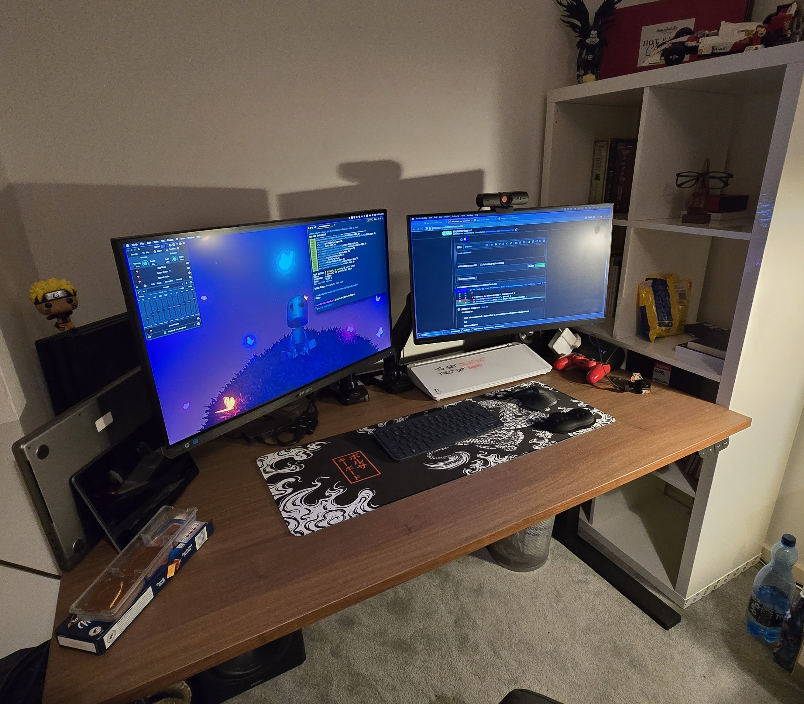
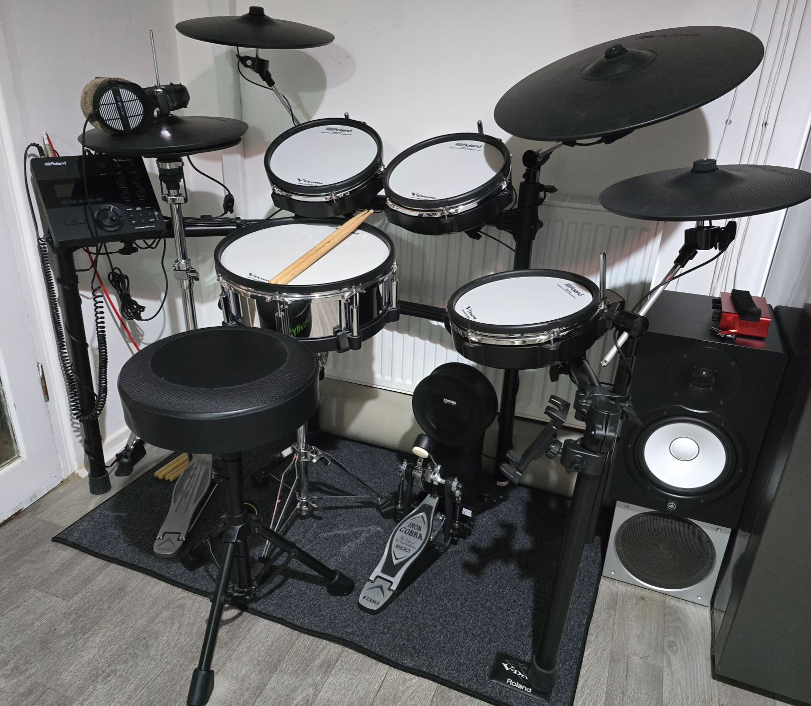
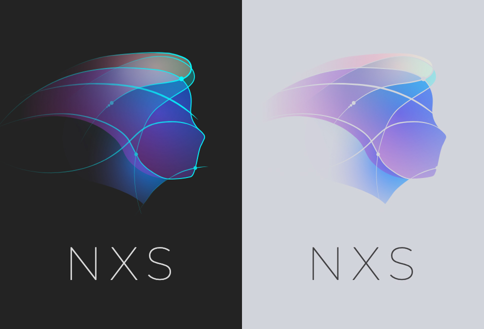

## Who are you and what do you do?

Hi, I’m Rob, originally from Poland, moved to UK in 2015 - so it’s been 10 years now. Back then, THE grand plan was to enrol to BIMM music institute for a sound engineering degree and work my way up to becoming the next Hans Zimmer… ambitious, I know 😂

I spent over 12 years producing electronic music, mostly drum and bass, and a couple of years DJ'ing - though only in my bedroom - and most recently, for about year and a half I’ve been learning to play drums - a childhood dream of mine.

Outside of music and tech, I’m a big Lego fan (currently sitting at just over 20 sets) and a massive F1 enthusiast. Nothing beats a good race weekend!

## What first got you into tech?

I guess my dad. Ever since we had our first PC at home (Intel Celeron CPU clocking at a whopping 800 MHz🔥), he would show me how to open it up and maintain both the hardware and OS. I remember being fascinated by a printout of his mechanical engineering master's thesis written in Fortran back in the 80s. At some point, he brought me a CD with one of the early IDEs called "Pajączek" (English: "Little Spider"), which became my first introduction to HTML and CSS.

During high school, I really got into Photoshop, creating graphics for friends and posters for local events. These skills later proved valuable during my apprenticeship at technical/vocational school, where I was offered a full-time job as a graphic designer. This was during an era when websites were designed entirely in Photoshop, "sliced," and passed to developers as raster graphics. I kind of miss those days - there was much more creativity involved, and websites tended to have that unique vibe.

## What does your typical working day look like?

After dropping my son off to school, I’d usually pop-in to a polish shop for a freshly baked bread rolls, get home, brew a cup off coffee and get ready for a morning stand-up which usually happens at 9:30. The first 15 minutes are reserved for quality banter - then we try to squeeze in 15 minutes of actual work updates.

Our team currently consists of just three developers (including myself), with a few colleagues from our Spanish branch helping out with AI-related features.

We solely work on a single project called NXS (Nexus) Data - an end-to-end solution for market data analysis and visualisation. For the most part I'm responsible for a front end side of the application, so typically I would be either implementing an entire new feature, refactoring legacy parts, or upgrading old packages driving modern use of modern solutions. Over the course of 5 years it evolved from being just a plugin to a full-fledged standalone application.

When I joined two years ago, I was tasked with building an admin panel for user and role management. Currently, I’m working on implementation of a secondary data ingestion system which will be used to feed data into AI driven anomaly detection model - exciting stuff!

## What’s your setup? Software and hardware. Pictures welcomed!

Hardware:

- Apple 14” M1 MacBook Pro - I was a Windows guy ever since my first PC, but once I tasted the world of MacOS a couple years back, I have never looked back.
- Primary screen - used to be 27” Phillips IPS, but just a few days ago died on me - an upgrade that was long awaited
- Secondary screen - Pixio Hayabusa 2, 24” full HD gaming IPS @240hz, brilliant panel, but a little small, mostly use it in portrait for the docs…
- MX Keys Mini + MX Master 3
- Ikea MITTZON 160x80 sit-stand desk
- Beyerdynamic DT770 Pro 80Ohm
- Yamaha HS8 + Focuswrite Scarlett Solo
- My pride and joy - Roland TD27 KV2 edrums

Software:

- IDE: VS Code
- Terminal: Warp + OhMyZSH
- Launcher: Raycast
- Browser: Firefox Nightly
- DAW: FL Studio and Ableton

## What’s the last piece of work you feel proud of?

A few months ago, I had the pleasure of rebranding our entire app. Up until then, there hadn’t been a clear or consistent design direction, so it was a great opportunity to bring some cohesion and personality to the product.

It also gave me a chance to jump back into Figma and Illustrator - something I’ve always enjoyed. I designed a new logo, created both light and dark themes, and implemented it. It was super refreshing task.

## What’s one thing about your profession you wish more people knew?

In recent years, coding has become incredibly accessible. You don’t need a fancy university degree to get into the field - just passion, patience, and a way to showcase your skills and problem-solving ability, whether through a portfolio or a hobby project.

## Share with others something worth checking out. Not necessarily tech related. Shameless plugs welcomed.

- For anyone remotely interested in tech I cannot recommend it enough - [Darknet Diaries](https://darknetdiaries.com/) by Jack Rhysider - my favourite podcast of all time. Perfect blend of true-crime story telling and the world of cyber security.
- As a shameless plug - few of my favourite tracks I produced over the years under alias ‘Collision Vortex’
- - [Life Path](https://soundcloud.com/collision-vortex/life-path)
- - [Kinetic](https://soundcloud.com/collision-vortex/collision-vortex-kinetic2)
- - [Keep Going](https://soundcloud.com/collision-vortex/keep-going-pre-master)
