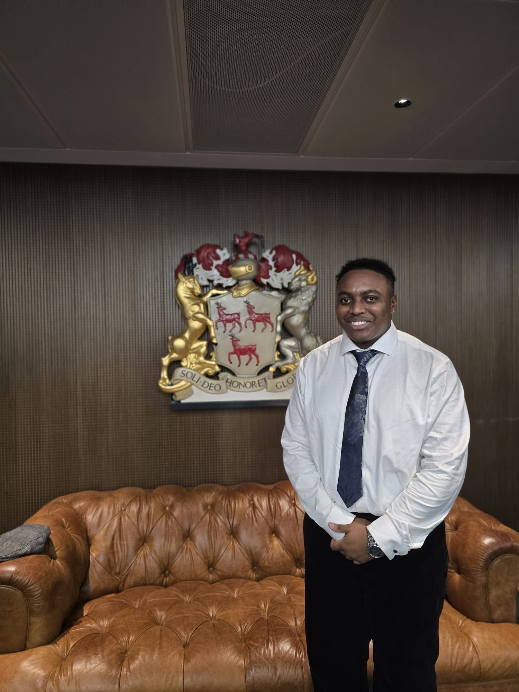
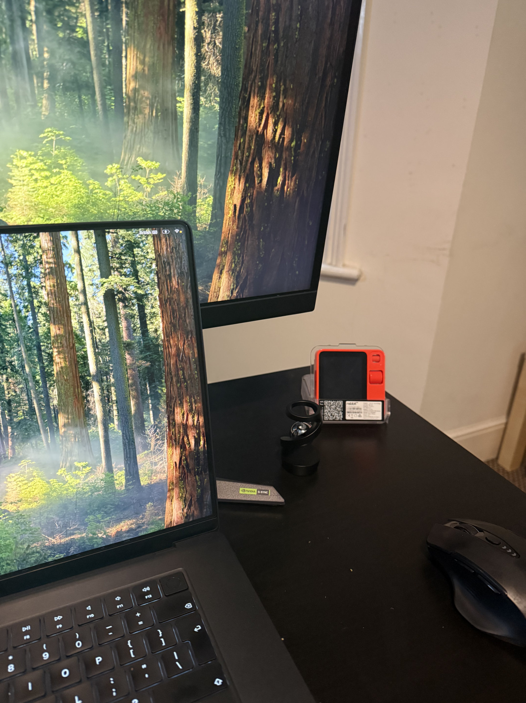

## Who are you and what do you do?

I’m Ryan, a final-year AI and Data Science student at the University of Northampton. 
I mentor the UON AI & Robotics Society after previously serving as President and Treasurer, and I also work as a Student Futures Career Coach, helping students with CVs, applications and interview prep. I’m quite a proactive person and I rarely have just one thing on my plate – if there’s a research, competition or industry-linked project happening at the university, I’m usually involved in some way. A lot of my current work revolves around chatbots and conversational AI – especially mental-health and support-focused bots – so most of my projects end up circling back to “how do we make chatbots more helpful, reliable and safe?”

## What first got you into tech?

I’ve always been drawn to technology. When I was younger, I’d spend a lot of time on my laptop or phone just fiddling with things – trying out new apps, customising settings and generally seeing what I could make the device do. That curiosity gradually turned into wanting to build things myself instead of just using them.

At first, I was mainly interested in data science, but I kept asking myself: if we look a bit further into the future, what comes after this? That’s when I really discovered AI. I didn’t know much about it at the start, so I began reading and realised it was a perfect mix of everything I enjoyed: tech, data science and mathematics. It felt like a natural next step for my interests.

On top of that, I’ve always loved sci-fi films that explore AI and intelligent systems, so seeing those ideas on screen definitely helped pull me even closer towards studying AI properly.

## What does your typical working day look like?

On a typical day I’m juggling between being a final-year AI student and an aspiring researcher. In term time I’ll usually start with lectures or labs, then block out a bit of time afterwards to work through assignments.

Alongside that I almost always have a side project running. Sometimes it’s a Kaggle or other competition, sometimes it’s an idea I’ve had and want to prototype. I don’t finish every single one, but I like constantly having something on the go that stretches me beyond the syllabus and keeps my skills fresh.

A couple of days a week I’m also working as a Student Futures Career Coach, helping other students with CVs, applications and interview prep. Toward the end of the day I try to wind down by watching YouTube – usually a mix of podcasts, gaming content and the occasional podcast – just to reset my brain before the next day.

## What's your setup? Software and hardware. Pictures welcomed!

### Hardware:

MacBook pro M3 Max (48GB RAM)
ASUS XG49V 49-inch monitor
AirPods Max

### Software:

IDE: Cursor
Stack: Python, PyTorch, scikit-learn, Pandas
Compute: Runpod

The monitor is essential for multitasking, plus I keep things deliberately light since I'm constantly on the move. When a project needs serious compute, I just spin up Runpod or use the university's machines. It's a setup that lets me work from anywhere without being tied to one desk.


## What's the last piece of work you feel proud of?

The most recent piece of work I’m proud of is our [UniMind mental-health chatbot](https://github.com/ryantigi254/AI_project_data_cleaning) for University of Northampton students. We set ourselves a clear goal: build a chatbot that can plan a therapeutic conversation rather than just reply turn-by-turn, and that supports students without trying to “solve” their problems – instead listening, normalising, and then signposting to UON services, crisis lines, or self-help tools like breathing and grounding exercises.

Architecturally, we used a multi-agent setup where one agent plans the conversation in stages (rapport → assessment → support), another executes the empathetic dialogue, and a third pulls in university resources and crisis options when needed. That design paid off in testing: we reached 99.9% crisis-detection accuracy, around 97% plan-alignment for staying on a helpful trajectory, an average 8.2/10 user-satisfaction score, and an estimated 89% cost reduction compared with traditional one-to-one counselling for the same scale of support.

I’m proud of it because it proved we could combine careful safety design, conversation planning and real metrics into something that actually feels useful for students, and it’s a big part of why my newer projects (like my NLP project and Dissertation) continue to focus on safe, support-focused chatbots.

## What's one thing about your profession you wish more people knew?

I wish more people realised how deliberate most AI students are about choosing this field. You don’t usually end up on an AI degree by accident – you pick it knowing the technology is moving fast and that, in some areas, models may eventually do parts of what graduates can do today.

That reality forces us to think hard about where we add value and to stay very close to the latest developments. A lot of my classmates and I spend real time following new models, safety debates and ideas like AGI/ASI and consciousness, and talking about how they might affect both society and our own careers. It’s not just “doing the modules”; we’re constantly re-evaluating our skills and strategy because as AI evolves, the job market evolves, and we have to evolve with it.

## Share with others something worth checking out. Not necessarily tech related. Shameless plugs welcomed.

If you enjoy going down rabbit holes, I'd really recommend keeping an eye on state-of-the-art AI safety and interpretability work from groups like Anthropic and Apollo Research especially ideas like in-context scheming, alignment faking, and sycophancy. That work has heavily inspired my current NLP project, where I’m building a small benchmark to stress-test mental-health LLMs: how well the models keep their reasoning faithful to the underlying clinical logic(which can reveal when models ['scheme'](https://arxiv.org/pdf/2412.04984) by giving correct answers with fabricated rationales), how robust their truthfulness is under social pressure ([sycophancy](https://arxiv.org/abs/2310.13548)), and whether a small case-summary memory helps them stay consistent and safe over longer chats.


That links into my dissertation work on Robert, a proposed chatbot for adults with BPD/EUPD who need short, non-judgemental support between therapy sessions. The design combines a non-directive chat flow, brief skills and signposting, and a lightweight “what helped last time” memory, all inside a conservative safety framework. For evaluation, we involve NHS clinicians throughout the iterative build, testing and refining the chatbot as the system develops.

And for a shameless plug: my personal website, [ryangichuru.com,](https://ryangichuru.com) is the best place to see what I’m up to. I keep my projects, experience and write-ups there, along with the occasional blog post about something I’m up to.
