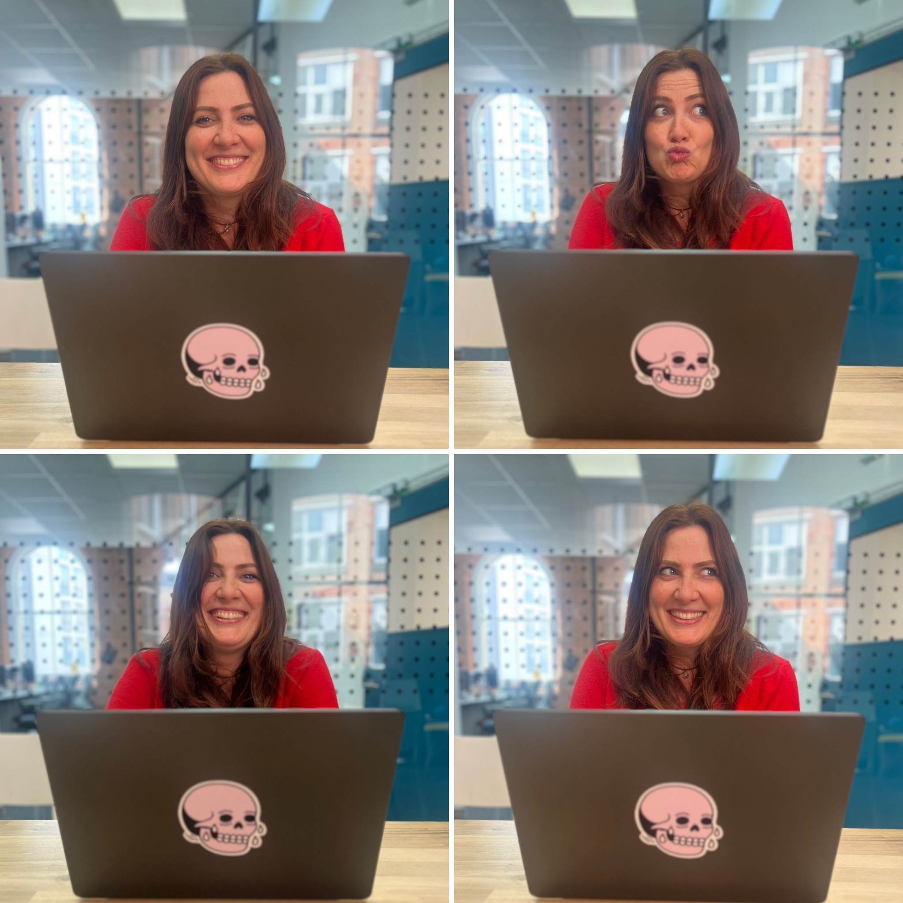

## Who are you and what do you do?

Hiya, I’m Sally, I’m a midlands girl, born and bred. I enjoy going to as many gigs as I can fit in, travelling and just spending loads of time having fun. My first career move was becoming a ski instructor, so not really tech… just a walkie talkie for those days off piste.

## What first got you into tech?

When I was a kid I loved video games, playing Sonic on my Sega Mega Drive was my favourite and, I’m not going to lie, I loved my Barbie’s, diverse! We fought over the one computer in the house, mostly to chat to mates on MSN messenger and download music on Limewire. (Shhh)

I got into tech when I realised that there wasn’t much money in teaching people how to ski and to follow the snow you kind of had to be loaded, and I wasn’t. I come from a proud working class background, so naturally, my next move was to pick up a second job and start making enough cash

I started working in an office as admin whilst teaching at my local dry ski slope. The tech team would get really fed up with me finding bugs and eventually they asked me to be their QA! That’s how I got into tech as a career. I self studied and took an ISTQB qualification, and then eventually moved into a full time QA role. I ended up moving roles to be a QA lead after some time working with a telecommunications company and then I moved to Mindera after a brief stint in Switzerland, which I hated… it was for a bank and way too corporate and boring for my personality, so I came home.

I’ve been at Mindera for over 5 years now and in that time I was QA lead for an apps team, then I naturally fell into a product owner role. These two roles have been my bread and butter predominantly over the last 5 years but in that time I was also asked to help out as a delivery lead and business analyst.

## What does your typical working day look like?

My passion is working with development teams to help build something cool, something that we can all be proud of.

I like to think about the reasons why we are creating something, making sure that everyone in the team always has a voice and then making the right movements to go forward with an idea.

My day to day is basically lots of talking to people to get the right info to then pass onto the very talented people in my team.

I’m currently working with IAGL which is more commonly known as Avios. I am a product owner on a full-stack team. We have been creating a new product which is due to launch pretty soon and I’m actually shitting my pants but hey, what’s the worst that can happen.

After work, I like to hang out, play some squash or basketball or just head to the local with my mates… if I’m tired I’ll just head home and watch some quizzes or the latest series, did someone say Pedro Pascal?? haha.

## What’s your setup? Software and hardware. Pictures welcomed!

I am pretty lucky to have a new M4 MacBook Pro, it’s black and has a cool Mr Heggie sticker on it, check him out on insta. A huge monitor at the Leicester Mindera office, where I work from mostly. Occasionally I nip to London to see the Avios lot and just take my laptop.

I’m usually chatting on Slack, video calling on teams, all over Jira, Figma, Datadog, Spotify.

## What’s the last piece of work you feel proud of?

I’m super proud of the product I’m about to launch, it’s been a long time coming and it’s brand new for Avios. It’s had a lot of hard work put into it by all of the team and I’m excited for them to be proud too.

We get to work with a cool bunch of people and I don’t dread going to work, I feel really lucky for that and I’m proud I contribute to that feeling for the rest of my team.

## What’s one thing about your profession you wish more people knew?

When I tell people I’m a product owner I mostly have to explain what that is because they think that I have created something physical, like a fidget spinner that I’m selling on my Etsy store. I always end up saying, “a little bit like a project manager” which people tend to understand more.

Maybe I’d like people to know that being a product owner basically means I’m a professional plate spinner haha launching a new product means my brain is in five places at once. One moment I’m knees deep owning the backlog in Jira and the next I’m trying to communicate the product vision I have to stakeholders.

## Share with others something worth checking out. Not necessarily tech related. Shameless plugs welcomed.

- [mr_heggie on Instagram](https://www.instagram.com/mr_heggie/) - very cool artist who made my laptop sticker
- [kneecap32 on Instagram](https://www.instagram.com/kneecap32/) - my current favourite band
- [macugnaga_monterosa on Instagram](https://www.instagram.com/macugnaga_monterosa/) - underrated favourite ski area
