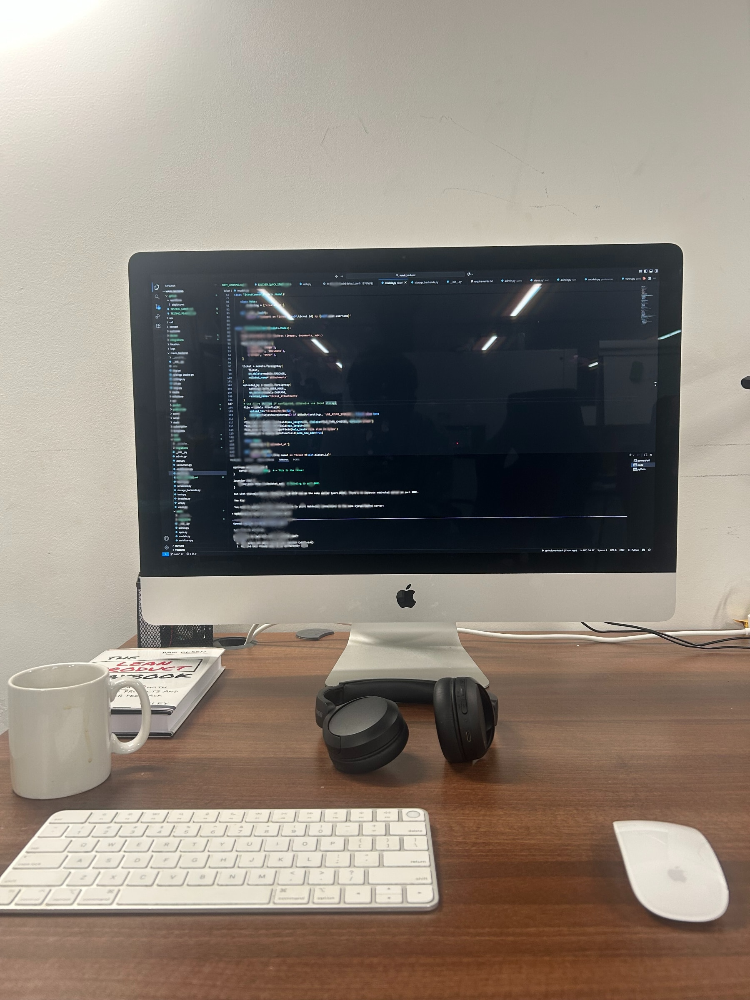

## Who are you and what do you do?

I'm Sanindu Rathnayake, a software engineer who enjoys working on projects that connect software engineering and AI. I recently completed my master's in Computing at the University of Northampton. Lately, I've been exploring solution architecture, accessibility technology, and ways to design scalable and maintainable software systems. Outside of work, I love playing the violin, going hiking, and doing a bit of photography whenever I can.

## What first got you into tech?

I've always been interested in technology since I was a child. I used to collect tech magazines and build small Arduino projects, and it was fun to make things work. When I started my degree, I learned the theory behind technology, but I wasn't completely sure if I had made the right choice. That changed after I did my internship as a software engineer, where I built web applications used by real people. During the COVID period, I started building my own apps and using what I had learned in a practical way. That's when I realised how much I enjoy doing this. After that, I joined IFS as a software engineer and started my career there with an amazing work culture and supportive people who helped me learn and grow.

## What does your typical working day look like?

I usually wake up around 8 am and start my day by making breakfast. I begin work at about 9.30 am, and of course, coffee is a must.
The nice thing about working at a startup is the freedom I get to both design and develop projects. My day often involves designing software solutions, developing and testing them, finding bugs and improving the system. I usually finish work around 5.30 pm and then make dinner.

I wasn't really into books before, but I recently started reading before bed, and honestly, it's been really good. I usually go to sleep around 11.30, sometimes still thinking about how I can fix the bug the next day.

## What's your setup? Software and hardware. Pictures welcomed!

Hardware: iMac, Acer Swift, Samsung Galaxy Tab, SONY Headphone. Software: IntelliJ IDEA, VS Code, Postman.

## What's the last piece of work you feel proud of?

I'm working on a project at Mavis Technologies to build a software system for smart glasses that helps blind or visually impaired people. I'm proud of this work for a few reasons.

First, the project itself is very interesting. It feels great to know that what I build can help someone live more independently. That's what I love about software engineering. You can create something that makes a real difference in someone's life.
I've also had the chance to test the product with real blind users, get their feedback, and improve it based on their experience. Seeing the difference it makes for them is such a good feeling.

Another thing I'm proud of is that I joined the project as one of the first contributors. I got to be involved from designing the system all the way to taking it into production. It gave me great hands-on experience and helped me grow a lot as an engineer.

## What's one thing about your profession you wish more people knew?

I wish more people were aware of how important accessibility is when building software or websites. It may be easy to focus on how something looks or performs, but not everyone experiences technology the same way. Considering accessibility means we design things that everyone can use, including people with disabilities. Even small design choices can make a big difference in how someone interacts with a product.

## Share with others something worth checking out. Not necessarily tech related. Shameless plugs welcomed.

If you're new to adding accessibility features to your website, it's worth checking out the [WAVE browser extension](https://wave.webaim.org/extension/).
