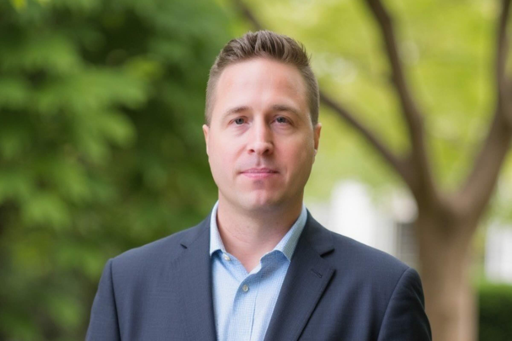
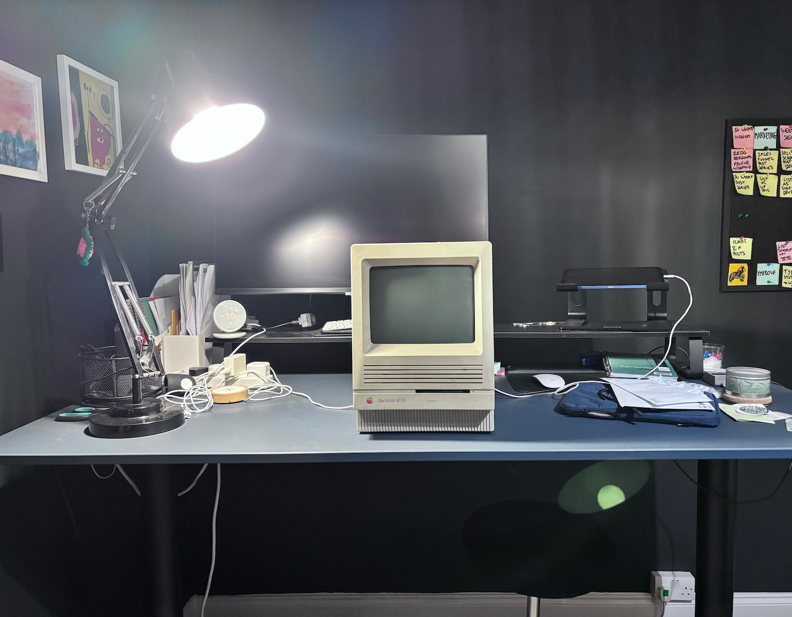

## Who are you and what do you do?

Hi! I'm Sean and I run a company called [Toru Digital](https://www.toru.digital). We're based in Northampton and we act as a 'creative technology partner' to our clients, helping them use tech to solve their problems and explore new opportunities. We have a small but highly skilled and motivated team of designers, developers and various other specialists. We've been running since 2008, have Investors in People Gold, and right now we're going for BCorp accreditation.

In terms of my background, I studied music at uni and then did a Masters in Design. Whilst doing that I worked as a graphic designer, animator and Actionscript developer (AS3 is still my favourite language - RIP). I worked for an E-learning company and really enjoyed the challenge of combining design and UI development to create unique and engaging user experiences.

I've definitely based my company on this mixture of creative and engineering thinking. And it goes without saying that right now we're really excited about AI and what opportunities it can bring to our clients.

## What first got you into tech?

My music degree had a big tech component to it, as well as studying some really interesting avant garde composers. On the tech side music composition, production and performance were all becoming digital-first, and there were loads of cool new apps and hardware to explore.

As part of my degree show I decided to experiment with new kinds of interactive musical instruments, which involved combining custom hardware builds with software I built in the graphical programming language MaxMSP. I absolutely loved this side of it and since that project I gradually moved from music to programming. For my Masters I continued in this vein and built some audio/visual instruments based on my study of synaesthesia using XCode and Processing.

In my various jobs before I set up Toru Digital there was always a need for someone to do some programming, and there weren't any dedicated coders on the teams I worked in. So I jumped at any opportunity I got to code up interfaces, build websites, hook up LMSs, connect APIs etc. I winged it all and loved every minute of it!

## What does your typical working day look like?

It changes from week to week. We always have a team standup at the start of the day, and I am always responsible for getting the sales work done. But beyond that it depends on what the current priorities of the business are.

Right now for example I am working on creating new AI-focused roles within our company, and on creating clear 'career pathways' for everyone in the team so that they can better understand their next steps and what they need to do to get there.

Also we have 2 large projects on that are both in design/early-build phases and I contribute to those when I can. One of these is building a web app for a client that syncs their Salesfoce product data and presents it in a really intuitive way to their customers. The other is the development of a mental health AI platform for professionals who have experienced burnout.

## What’s your setup? Software and hardware. Pictures welcomed!

I'm afraid I'm probably a bit boring in this respect. I've always been an Apple Mac fan. My dad got me into that back in the 90s - see my old SE/30 below. It still boots up but doesn't quite cut it for client work any more.

At work we use VMs to run Ubuntu dev boxes and then whatever code editor is currently the most popular. We use AI tools like Cursor & Claude Code of course, but otherwise our setup is very standard for a dev agency. We use PHP on the back end, and have various custom libraries that we've written over the years to get new projects up and running fast. On the front end it's VueJS/Nuxt & TailwindCSS, and it's all hosted in AWS.

So the setup is standard but when I get an opportunity to fire up a Vagrant box to code or fire up Figma to design I'm back in my happy place:)

## What’s the last piece of work you feel proud of?

I've worked really hard to build up our team and when I see them working to a really high standard, with amazing attitudes and I see that they clearly love what they do, that's what I'm most proud of.

In terms of my own thing, I really ennjoyed experimenting in ThreeJS to [bring our new company brand to life](https://dribbble.com/shots/25920791-Toru-Digital-Brand).

## What’s one thing about your profession you wish more people knew?

Sorry but here's more than one thing (I'll keep them short though)

- Now is the best time ever to set up a new company. AI opens up a million doors to do new things, and do existing things differently. Your competition are existing companies who will not be as nimble as you.
- AI is so much more than the platforms and personalities that grab the headlines. There are so many amazing open source tools, models & projects freely available on sites like [Hugging Face](https://huggingface.co/) to experiment with.
- Whilst every profession will be transformed by AI, human values/skills/needs persist and people should be excited not scared.

## Share with others something worth checking out. Not necessarily tech related. Shameless plugs welcomed.

I recently found out there was a [Lido in Woburn](https://woburnlido.weebly.com/). Swimming in the summer rain is always a treat!
