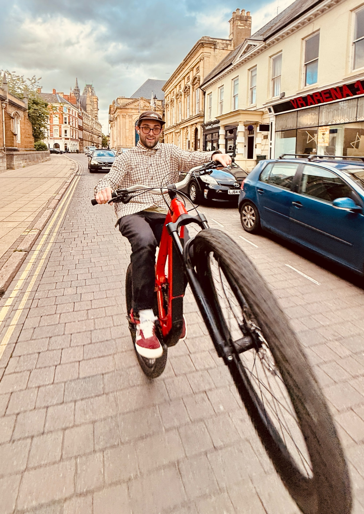
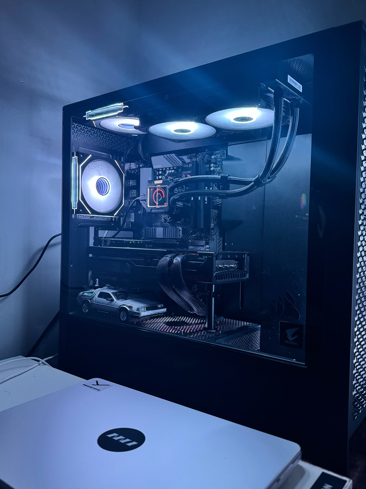

## Who are you and what do you do?

Hi I'm Seb. I work in electrical industry, mostly in designing bespoke BMS systems. Love listening to variety of music on a great analogue system and shredding on two wheels!

## What first got you into tech?

Certainly gaming!

## What does your typical working day look like?

Start off with a cup of great coffee for sure! Never start the day later than 7am and without a bike ride! My projects usually take from three days up to even a full month each so rather difficult to say how a usual day looks like as each day is full of new challenges!

Certainly most fun part? Wiring!

## What's your setup? Software and hardware. Pictures welcomed!

14” M1 pro and a cheeky nuclear reactor for the gaming in the evenings. AMD 5600x/7900xt 20GB with a 40” 1440p ultrawide.

## What's the last piece of work you feel proud of?

Probably being a part of building BMS systems for Excel London! Super complex project.

## What's one thing about your profession you wish more people knew?

How quickly you fall in love with it!

## Share with others something worth checking out. Not necessarily tech related. Shameless plugs welcomed.

Get a bike! ❤️
