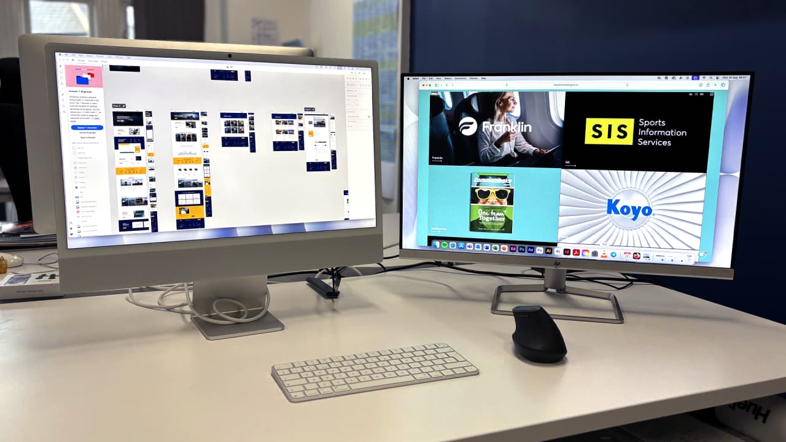
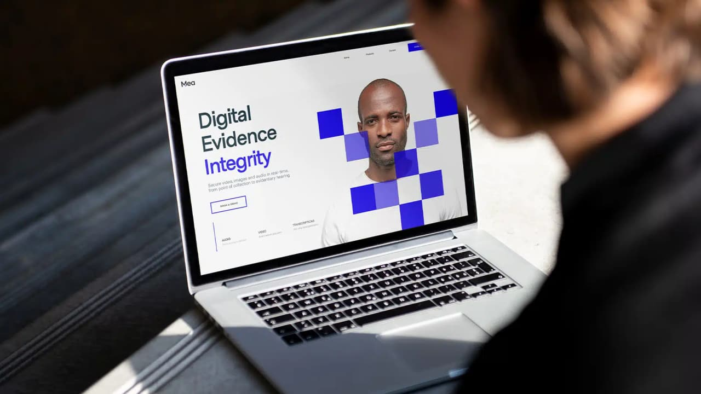

## Who are you and what do you do?

I’m Tom Ellis, Creative Lead at [Beach](https://www.beachmarketing.co.uk), a B2B marketing agency on the Welly Road in Northampton. I help businesses explain who they are and what they do in a way people actually get. That usually means working out how to simplify their story, then building a visual identity around it: logos, websites, animations, campaigns. I get involved from the strategy through to the finished design, making sure the creative feels right and delivers. Outside of work, I’m a husband and dad, which is probably my most important (and most fun) job.

## What first got you into tech?

I started in print with posters, brochures, and catalogues. Then digital took over and suddenly it was all websites and animations. Now 80% of what I do is digital, but I still love print… nothing beats the smell of fresh ink.

## What does your typical working day look like?

Mornings usually start with trying to get my daughter, who’s firmly in her threenager stage, out the door to nursery. Then coffee, desk by 8:30, and into whatever the day brings: maybe a photoshoot, a brand job, or a website. Lunch is often a stroll in Abington Park before the mad dash across the A45 to pick my daughter up.

## What’s your setup? Software and hardware. Pictures welcomed!

Once you go Mac, you never go back. I’m on an iMac M4, smooth, fast, and perfect for design. (Yes, I can already hear the devs groaning.)

## What’s the last piece of work you feel proud of?

A recent branding project for a blockchain security company. The challenge was making something complex feel simple and trustworthy without falling into cliché “tech” visuals. Seeing it all come together was a proud moment. Feel free to check out the project here: [MEA Branding Case Study](https://www.beachmarketing.co.uk/portfolio/mea/).

## What’s one thing about your profession you wish more people knew?

KISS: Keep It Simple, Stupid. Design isn’t about being flashy, it’s about clarity.

## Share with others something worth checking out. Not necessarily tech related. Shameless plugs welcomed.

[SpaceTypeGenerator](https://spacetypegenerator.com) is a fun tool for playing with animated type.

