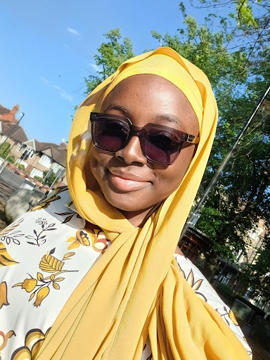
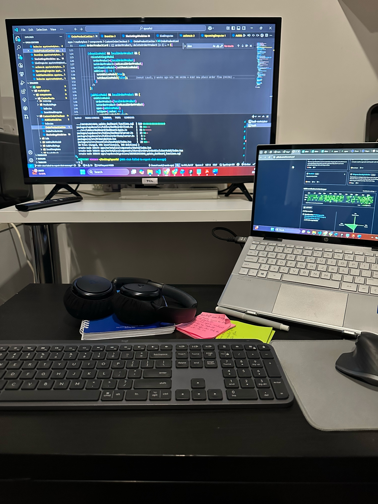

## Who are you and what do you do?

Hi! My name is Zeenat. I’m a Frontend Software Developer at SPAARKD, where I build responsive, user-friendly web applications. Alongside my role, I’m pursuing an MSc in Software Engineering at the University of Northampton. I enjoy creating user-friendly systems with a clean UI that make people's lives easier and have a positive impact.

## What first got you into tech?

Growing up, I was always curious about how things work, especially anything digital. I remember designing birthday invitation cards for fun as a teenager using Microsoft Word, and that interest eventually led me to pursue a degree in Computer Science.

My first real experience with development was creating a simple landing page for an e-commerce website by following a tutorial from a senior colleague at school, and I was amazed by how code could generate something visual and interactive. I've been hooked ever since.

## What does your typical working day look like?

As both a developer and a student, my day is filled with coding, collaborating, and studying. I usually start my mornings around 6 AM with prayer and some time to prepare for the day.

I then start my workday by 7 AM, where I manage tasks such as implementing UI features and resolving bugs or performance issues. I usually take a break around noon and return to work after an hour to complete any pending tasks.

After work, I relax by either reading or watching a movie, and occasionally doing some cooking.

Finally, around 7 PM, I focus on university work, which includes assignments, research, and my dissertation project.

## What’s your setup? Software and hardware. Pictures welcomed!

### Hardware:

- PC: HP Pavilion x360 Convertible
- Mouse: Logitech MX Master 3
- Keyboard: Logitech MX Keys
- Headphones: Soundcore Space Q45

### Software:

- IDE: VS Code
- Design: Figma
- Version Control: GitHub

## What’s the last piece of work you feel proud of?

I developed a smart city application using React Native and Firebase for an assignment. The app integrates business and hospital management features, offering role-based dashboards, organisation switching, and scheduling features. This was my first project with React Native, and although it was a bit challenging, the learning process was fun, which makes me eager to build more mobile apps.

## What’s one thing about your profession you wish more people knew?

I wish more people understood that front-end development is not just about creating visually appealing web pages. It's also about creating a seamless user experience, which often requires thinking like a designer, a user, and an engineer all at the same time.

## Share with others something worth checking out. Not necessarily tech related. Shameless plugs welcomed.

I recently wrote an [article on Medium](https://medium.com/@zeenatlawal82/learning-mobile-development-with-react-native-as-a-react-developer-23d189899020) about my first React Native Project, and I’m currently developing a health app as part of my dissertation to support Sickle Cell patients and caregivers, which is a cause I’m passionate about. I’ll be sharing updates on that soon on my [GitHub](https://github.com/ZeenatLawal) and [portfolio](https://zeenatlawal.github.io/Portfolio/).
